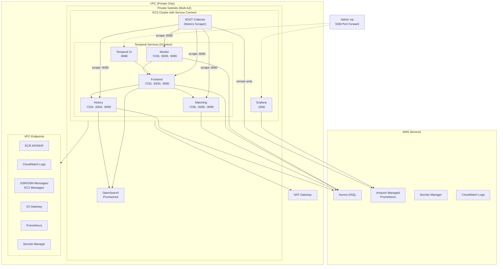
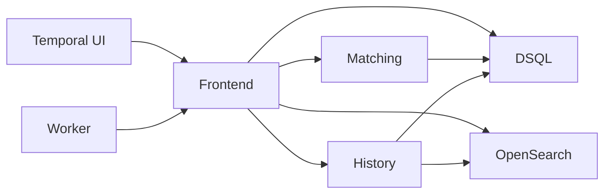
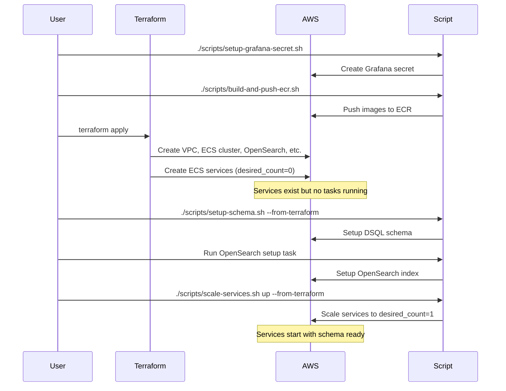

# Design Document: Temporal ECS EC2 Deployment

## Overview

This design describes a minimal development deployment of Temporal on AWS ECS with EC2 instances (Graviton) using a fully private architecture. Temporal is deployed as **five separate ECS services** (History, Matching, Frontend, Worker, UI) using **ECS Service Connect** for inter-service communication. The solution uses Aurora DSQL for persistence, OpenSearch Provisioned for visibility, Amazon Managed Prometheus for metrics, and Grafana on ECS for dashboards. All access is via ECS Exec and SSM port forwarding—no public endpoints exist.

Key design principles:
- **Multi-service architecture**: Separate ECS services for each Temporal component
- **ECS Service Connect**: Modern service mesh with Envoy sidecar for faster failover than DNS-based discovery
- **ECS on EC2 with Graviton**: 3x m7g.large ARM64 instances with workload-specific placement for stable IPs
- **Private-only networking**: VPC endpoints for AWS services, no public subnets
- **IAM-based authentication**: DSQL uses IAM auth, no stored credentials
- **ECS Exec + Port Forwarding**: Remote access to Temporal UI and Grafana

## AWS Documentation References

- [ECS Service Connect](https://docs.aws.amazon.com/AmazonECS/latest/developerguide/service-connect.html)
- [Working with 64-bit ARM workloads on Amazon ECS](https://docs.aws.amazon.com/AmazonECS/latest/developerguide/ecs-arm64.html)
- [Amazon ECS interface VPC endpoints](https://docs.aws.amazon.com/AmazonECS/latest/developerguide/vpc-endpoints.html)
- [Aurora DSQL Authentication](https://docs.aws.amazon.com/aurora-dsql/latest/userguide/authentication-authorization.html)
- [Using ECS Exec for debugging](https://docs.aws.amazon.com/AmazonECS/latest/developerguide/ecs-exec.html)
- [Amazon ECS capacity providers](https://docs.aws.amazon.com/AmazonECS/latest/developerguide/cluster-capacity-providers.html)
- [Amazon ECS task placement constraints](https://docs.aws.amazon.com/AmazonECS/latest/developerguide/task-placement-constraints.html)


## Architecture



### Service Dependencies




## Components and Interfaces

### 1. VPC and Networking

The VPC contains only private subnets across multiple availability zones. A small public subnet exists solely for the NAT Gateway.

```hcl
# VPC Configuration
resource "aws_vpc" "main" {
  cidr_block           = var.vpc_cidr  # Default: "10.0.0.0/16"
  enable_dns_hostnames = true
  enable_dns_support   = true
  
  tags = { Name = "${var.project_name}-vpc" }
}

# Private Subnets (one per AZ)
resource "aws_subnet" "private" {
  count             = length(var.availability_zones)
  vpc_id            = aws_vpc.main.id
  cidr_block        = cidrsubnet(var.vpc_cidr, 4, count.index)
  availability_zone = var.availability_zones[count.index]
  
  tags = { Name = "${var.project_name}-private-${count.index}" }
}

# Public Subnet for NAT Gateway only
resource "aws_subnet" "public_nat" {
  vpc_id                  = aws_vpc.main.id
  cidr_block              = cidrsubnet(var.vpc_cidr, 8, 255)  # Small /24 at end of range
  availability_zone       = var.availability_zones[0]
  map_public_ip_on_launch = false
  
  tags = { Name = "${var.project_name}-nat-public" }
}

# NAT Gateway (single for dev cost optimization)
resource "aws_nat_gateway" "main" {
  allocation_id = aws_eip.nat.id
  subnet_id     = aws_subnet.public_nat.id
  
  tags = { Name = "${var.project_name}-nat" }
}
```


### 2. VPC Endpoints

VPC endpoints minimize NAT Gateway traffic and enable private connectivity to AWS services.

| Endpoint | Type | Service Name | Purpose |
|----------|------|--------------|---------|
| ecr.api | Interface | com.amazonaws.{region}.ecr.api | ECR API calls |
| ecr.dkr | Interface | com.amazonaws.{region}.ecr.dkr | Docker image pulls |
| logs | Interface | com.amazonaws.{region}.logs | CloudWatch Logs |
| ssm | Interface | com.amazonaws.{region}.ssm | ECS Exec - SSM |
| ssmmessages | Interface | com.amazonaws.{region}.ssmmessages | ECS Exec - SSM Messages |
| ec2messages | Interface | com.amazonaws.{region}.ec2messages | ECS Exec - EC2 Messages |
| secretsmanager | Interface | com.amazonaws.{region}.secretsmanager | Secrets retrieval |
| aps-workspaces | Interface | com.amazonaws.{region}.aps-workspaces | Prometheus remote write |
| s3 | Gateway | com.amazonaws.{region}.s3 | S3 access (ECR layers) |

```hcl
# Interface Endpoint Example (SSM for ECS Exec)
resource "aws_vpc_endpoint" "ssm" {
  vpc_id              = aws_vpc.main.id
  service_name        = "com.amazonaws.${var.region}.ssm"
  vpc_endpoint_type   = "Interface"
  subnet_ids          = aws_subnet.private[*].id
  security_group_ids  = [aws_security_group.vpc_endpoints.id]
  private_dns_enabled = true
  
  tags = { Name = "${var.project_name}-ssm-endpoint" }
}

# Gateway Endpoint for S3
resource "aws_vpc_endpoint" "s3" {
  vpc_id            = aws_vpc.main.id
  service_name      = "com.amazonaws.${var.region}.s3"
  vpc_endpoint_type = "Gateway"
  route_table_ids   = [aws_route_table.private.id]
  
  tags = { Name = "${var.project_name}-s3-endpoint" }
}
```


### 3. ECS Cluster with Service Connect

The ECS cluster uses Service Connect for inter-service communication, providing faster failover than DNS-based Cloud Map discovery. EC2 instances are managed via Auto Scaling Groups with workload-specific placement.

```hcl
resource "aws_ecs_cluster" "main" {
  name = "${var.project_name}-cluster"

  setting {
    name  = "containerInsights"
    value = "enabled"
  }

  configuration {
    execute_command_configuration {
      logging = "OVERRIDE"
      log_configuration {
        cloud_watch_log_group_name = aws_cloudwatch_log_group.ecs_exec.name
      }
    }
  }
  
  # Service Connect namespace
  service_connect_defaults {
    namespace = aws_service_discovery_http_namespace.main.arn
  }
}

# Service Connect namespace (HTTP namespace for Service Connect)
resource "aws_service_discovery_http_namespace" "main" {
  name = var.project_name
  
  tags = { Name = "${var.project_name}-namespace" }
}

# EC2 Launch Template for Graviton instances
resource "aws_launch_template" "ecs_node_a" {
  name_prefix   = "${var.project_name}-ecs-node-a-"
  image_id      = data.aws_ssm_parameter.ecs_ami_arm64.value
  instance_type = var.ec2_instance_type  # m7g.large

  iam_instance_profile {
    arn = aws_iam_instance_profile.ecs_instance.arn
  }

  user_data = base64encode(<<-EOF
    #!/bin/bash
    echo "ECS_CLUSTER=${aws_ecs_cluster.main.name}" >> /etc/ecs/ecs.config
    echo 'ECS_INSTANCE_ATTRIBUTES={"workload": "history"}' >> /etc/ecs/ecs.config
  EOF
  )
}

# Auto Scaling Group for Node A (History)
resource "aws_autoscaling_group" "ecs_node_a" {
  name                = "${var.project_name}-ecs-asg-node-a"
  desired_capacity    = 1
  min_size            = 1
  max_size            = 2
  vpc_zone_identifier = aws_subnet.private[*].id

  launch_template {
    id      = aws_launch_template.ecs_node_a.id
    version = "$Latest"
  }
}

# ECS Capacity Provider for Node A
resource "aws_ecs_capacity_provider" "ec2_node_a" {
  name = "${var.project_name}-ec2-node-a"

  auto_scaling_group_provider {
    auto_scaling_group_arn = aws_autoscaling_group.ecs_node_a.arn
    managed_scaling {
      status          = "ENABLED"
      target_capacity = 100
    }
  }
}
```


### 4. Temporal Service Task Definitions

Each Temporal service has its own task definition with specific port mappings and resource allocations.

#### 4.1 History Service Task Definition

```hcl
resource "aws_ecs_task_definition" "temporal_history" {
  family                   = "${var.project_name}-temporal-history"
  requires_compatibilities = ["EC2"]
  network_mode             = "awsvpc"
  cpu                      = var.temporal_history_cpu     # Default: 512
  memory                   = var.temporal_history_memory  # Default: 1024
  execution_role_arn       = aws_iam_role.ecs_execution.arn
  task_role_arn            = aws_iam_role.temporal_task.arn

  runtime_platform {
    operating_system_family = "LINUX"
    cpu_architecture        = "ARM64"
  }

  container_definitions = jsonencode([
    {
      name      = "temporal-history"
      image     = var.temporal_image
      essential = true
      
      command = ["temporal", "server", "start", "--service=history"]
      
      portMappings = [
        { containerPort = 7234, protocol = "tcp", name = "grpc" },
        { containerPort = 6934, protocol = "tcp", name = "membership" },
        { containerPort = 9090, protocol = "tcp", name = "metrics" }
      ]
      
      environment = [
        { name = "SERVICES", value = "history" },
        { name = "DB", value = "postgres" },
        { name = "DB_PORT", value = "5432" },
        { name = "POSTGRES_SEEDS", value = var.dsql_cluster_endpoint },
        { name = "ENABLE_ES", value = "true" },
        { name = "ES_SEEDS", value = aws_opensearch_domain.temporal.endpoint },
        { name = "ES_PORT", value = "443" },
        { name = "ES_SCHEME", value = "https" },
        { name = "PROMETHEUS_ENDPOINT", value = "0.0.0.0:9090" }
      ]
      
      logConfiguration = {
        logDriver = "awslogs"
        options = {
          "awslogs-group"         = aws_cloudwatch_log_group.temporal_history.name
          "awslogs-region"        = var.region
          "awslogs-stream-prefix" = "temporal-history"
          "awslogs-create-group"  = "true"
        }
      }
      
      linuxParameters = { initProcessEnabled = true }
    }
  ])
}
```


#### 4.2 Matching Service Task Definition

```hcl
resource "aws_ecs_task_definition" "temporal_matching" {
  family                   = "${var.project_name}-temporal-matching"
  requires_compatibilities = ["EC2"]
  network_mode             = "awsvpc"
  cpu                      = var.temporal_matching_cpu     # Default: 512
  memory                   = var.temporal_matching_memory  # Default: 1024
  execution_role_arn       = aws_iam_role.ecs_execution.arn
  task_role_arn            = aws_iam_role.temporal_task.arn

  runtime_platform {
    operating_system_family = "LINUX"
    cpu_architecture        = "ARM64"
  }

  container_definitions = jsonencode([
    {
      name      = "temporal-matching"
      image     = var.temporal_image
      essential = true
      
      command = ["temporal", "server", "start", "--service=matching"]
      
      portMappings = [
        { containerPort = 7235, protocol = "tcp", name = "grpc" },
        { containerPort = 6935, protocol = "tcp", name = "membership" },
        { containerPort = 9090, protocol = "tcp", name = "metrics" }
      ]
      
      environment = [
        { name = "SERVICES", value = "matching" },
        { name = "DB", value = "postgres" },
        { name = "DB_PORT", value = "5432" },
        { name = "POSTGRES_SEEDS", value = var.dsql_cluster_endpoint },
        { name = "PROMETHEUS_ENDPOINT", value = "0.0.0.0:9090" }
      ]
      
      logConfiguration = {
        logDriver = "awslogs"
        options = {
          "awslogs-group"         = aws_cloudwatch_log_group.temporal_matching.name
          "awslogs-region"        = var.region
          "awslogs-stream-prefix" = "temporal-matching"
          "awslogs-create-group"  = "true"
        }
      }
      
      linuxParameters = { initProcessEnabled = true }
    }
  ])
}
```


#### 4.3 Frontend Service Task Definition

```hcl
resource "aws_ecs_task_definition" "temporal_frontend" {
  family                   = "${var.project_name}-temporal-frontend"
  requires_compatibilities = ["EC2"]
  network_mode             = "awsvpc"
  cpu                      = var.temporal_frontend_cpu     # Default: 512
  memory                   = var.temporal_frontend_memory  # Default: 1024
  execution_role_arn       = aws_iam_role.ecs_execution.arn
  task_role_arn            = aws_iam_role.temporal_task.arn

  runtime_platform {
    operating_system_family = "LINUX"
    cpu_architecture        = "ARM64"
  }

  container_definitions = jsonencode([
    {
      name      = "temporal-frontend"
      image     = var.temporal_image
      essential = true
      
      command = ["temporal", "server", "start", "--service=frontend"]
      
      portMappings = [
        { containerPort = 7233, protocol = "tcp", name = "grpc" },
        { containerPort = 6933, protocol = "tcp", name = "membership" },
        { containerPort = 9090, protocol = "tcp", name = "metrics" }
      ]
      
      environment = [
        { name = "SERVICES", value = "frontend" },
        { name = "DB", value = "postgres" },
        { name = "DB_PORT", value = "5432" },
        { name = "POSTGRES_SEEDS", value = var.dsql_cluster_endpoint },
        { name = "ENABLE_ES", value = "true" },
        { name = "ES_SEEDS", value = aws_opensearch_domain.temporal.endpoint },
        { name = "ES_PORT", value = "443" },
        { name = "ES_SCHEME", value = "https" },
        { name = "PROMETHEUS_ENDPOINT", value = "0.0.0.0:9090" }
      ]
      
      logConfiguration = {
        logDriver = "awslogs"
        options = {
          "awslogs-group"         = aws_cloudwatch_log_group.temporal_frontend.name
          "awslogs-region"        = var.region
          "awslogs-stream-prefix" = "temporal-frontend"
          "awslogs-create-group"  = "true"
        }
      }
      
      linuxParameters = { initProcessEnabled = true }
      
      healthCheck = {
        command     = ["CMD-SHELL", "grpc_health_probe -addr=:7233 || exit 1"]
        interval    = 30
        timeout     = 5
        retries     = 3
        startPeriod = 60
      }
    }
  ])
}
```


#### 4.4 Worker Service Task Definition

```hcl
resource "aws_ecs_task_definition" "temporal_worker" {
  family                   = "${var.project_name}-temporal-worker"
  requires_compatibilities = ["EC2"]
  network_mode             = "awsvpc"
  cpu                      = var.temporal_worker_cpu     # Default: 512
  memory                   = var.temporal_worker_memory  # Default: 1024
  execution_role_arn       = aws_iam_role.ecs_execution.arn
  task_role_arn            = aws_iam_role.temporal_task.arn

  runtime_platform {
    operating_system_family = "LINUX"
    cpu_architecture        = "ARM64"
  }

  container_definitions = jsonencode([
    {
      name      = "temporal-worker"
      image     = var.temporal_image
      essential = true
      
      command = ["temporal", "server", "start", "--service=worker"]
      
      portMappings = [
        { containerPort = 7239, protocol = "tcp", name = "grpc" },
        { containerPort = 6939, protocol = "tcp", name = "membership" },
        { containerPort = 9090, protocol = "tcp", name = "metrics" }
      ]
      
      environment = [
        { name = "SERVICES", value = "worker" },
        { name = "DB", value = "postgres" },
        { name = "DB_PORT", value = "5432" },
        { name = "POSTGRES_SEEDS", value = var.dsql_cluster_endpoint },
        { name = "PROMETHEUS_ENDPOINT", value = "0.0.0.0:9090" }
      ]
      
      logConfiguration = {
        logDriver = "awslogs"
        options = {
          "awslogs-group"         = aws_cloudwatch_log_group.temporal_worker.name
          "awslogs-region"        = var.region
          "awslogs-stream-prefix" = "temporal-worker"
          "awslogs-create-group"  = "true"
        }
      }
      
      linuxParameters = { initProcessEnabled = true }
    }
  ])
}
```


#### 4.5 Temporal UI Task Definition

```hcl
resource "aws_ecs_task_definition" "temporal_ui" {
  family                   = "${var.project_name}-temporal-ui"
  requires_compatibilities = ["EC2"]
  network_mode             = "awsvpc"
  cpu                      = 256   # 0.25 vCPU
  memory                   = 512   # 512 MB
  execution_role_arn       = aws_iam_role.ecs_execution.arn
  task_role_arn            = aws_iam_role.temporal_ui_task.arn

  runtime_platform {
    operating_system_family = "LINUX"
    cpu_architecture        = "ARM64"
  }

  container_definitions = jsonencode([
    {
      name      = "temporal-ui"
      image     = "temporalio/ui:latest"  # Official Temporal UI image
      essential = true
      
      portMappings = [
        { containerPort = 8080, protocol = "tcp", name = "http" }
      ]
      
      environment = [
        # Service Connect provides 'temporal-frontend' DNS name
        { name = "TEMPORAL_ADDRESS", value = "temporal-frontend:7233" },
        { name = "TEMPORAL_CORS_ORIGINS", value = "http://localhost:8080" }
      ]
      
      logConfiguration = {
        logDriver = "awslogs"
        options = {
          "awslogs-group"         = aws_cloudwatch_log_group.temporal_ui.name
          "awslogs-region"        = var.region
          "awslogs-stream-prefix" = "temporal-ui"
          "awslogs-create-group"  = "true"
        }
      }
      
      linuxParameters = { initProcessEnabled = true }
    }
  ])
}
```


### 5. ECS Services with Service Connect

Each Temporal component runs as a separate ECS service with Service Connect configuration.

#### 5.1 History Service (Client-Server)

```hcl
resource "aws_ecs_service" "temporal_history" {
  name            = "${var.project_name}-temporal-history"
  cluster         = aws_ecs_cluster.main.id
  task_definition = aws_ecs_task_definition.temporal_history.arn
  desired_count   = var.temporal_history_count  # Default: 0

  capacity_provider_strategy {
    capacity_provider = aws_ecs_capacity_provider.ec2_node_a.name
    weight            = 1
  }

  network_configuration {
    subnets          = aws_subnet.private[*].id
    security_groups  = [
      aws_security_group.temporal_history.id,
      aws_security_group.ecs_instances.id
    ]
  }

  enable_execute_command = true

  # Placement constraint for Node A (workload=history)
  placement_constraints {
    type       = "memberOf"
    expression = "attribute:workload == history"
  }

  service_connect_configuration {
    enabled   = true
    namespace = aws_service_discovery_http_namespace.main.arn
    
    service {
      port_name      = "grpc"
      discovery_name = "temporal-history"
      client_alias {
        port     = 7234
        dns_name = "temporal-history"
      }
    }
  }
}
```

#### 5.2 Matching Service (Client-Server)

```hcl
resource "aws_ecs_service" "temporal_matching" {
  name            = "${var.project_name}-temporal-matching"
  cluster         = aws_ecs_cluster.main.id
  task_definition = aws_ecs_task_definition.temporal_matching.arn
  desired_count   = var.temporal_matching_count  # Default: 0

  capacity_provider_strategy {
    capacity_provider = aws_ecs_capacity_provider.ec2_node_b.name
    weight            = 1
  }

  network_configuration {
    subnets          = aws_subnet.private[*].id
    security_groups  = [
      aws_security_group.temporal_matching.id,
      aws_security_group.ecs_instances.id
    ]
  }

  enable_execute_command = true

  # Placement constraint for Node B (workload=frontend)
  placement_constraints {
    type       = "memberOf"
    expression = "attribute:workload == frontend"
  }

  service_connect_configuration {
    enabled   = true
    namespace = aws_service_discovery_http_namespace.main.arn
    
    service {
      port_name      = "grpc"
      discovery_name = "temporal-matching"
      client_alias {
        port     = 7235
        dns_name = "temporal-matching"
      }
    }
  }
}
```


#### 5.3 Frontend Service (Client-Server)

```hcl
resource "aws_ecs_service" "temporal_frontend" {
  name            = "${var.project_name}-temporal-frontend"
  cluster         = aws_ecs_cluster.main.id
  task_definition = aws_ecs_task_definition.temporal_frontend.arn
  desired_count   = var.temporal_frontend_count  # Default: 0

  capacity_provider_strategy {
    capacity_provider = aws_ecs_capacity_provider.ec2_node_b.name
    weight            = 1
  }

  network_configuration {
    subnets          = aws_subnet.private[*].id
    security_groups  = [
      aws_security_group.temporal_frontend.id,
      aws_security_group.ecs_instances.id
    ]
  }

  enable_execute_command = true

  # Placement constraint for Node B (workload=frontend)
  placement_constraints {
    type       = "memberOf"
    expression = "attribute:workload == frontend"
  }

  service_connect_configuration {
    enabled   = true
    namespace = aws_service_discovery_http_namespace.main.arn
    
    service {
      port_name      = "grpc"
      discovery_name = "temporal-frontend"
      client_alias {
        port     = 7233
        dns_name = "temporal-frontend"
      }
    }
  }
  
  # Note: Service dependencies are handled by health checks and retry logic
  # Frontend will retry connections to History and Matching until they're available
}
```

#### 5.4 Worker Service (Client-Only)

```hcl
resource "aws_ecs_service" "temporal_worker" {
  name            = "${var.project_name}-temporal-worker"
  cluster         = aws_ecs_cluster.main.id
  task_definition = aws_ecs_task_definition.temporal_worker.arn
  desired_count   = var.temporal_worker_count  # Default: 0

  capacity_provider_strategy {
    capacity_provider = aws_ecs_capacity_provider.ec2_node_c.name
    weight            = 1
  }

  network_configuration {
    subnets          = aws_subnet.private[*].id
    security_groups  = [
      aws_security_group.temporal_worker.id,
      aws_security_group.ecs_instances.id
    ]
  }

  enable_execute_command = true

  # Placement constraint for Node C (workload=worker)
  placement_constraints {
    type       = "memberOf"
    expression = "attribute:workload == worker"
  }

  service_connect_configuration {
    enabled   = true
    namespace = aws_service_discovery_http_namespace.main.arn
    # Client-only: no service block, only consumes other services
  }
}
```


#### 5.5 Temporal UI Service (Client-Only)

```hcl
resource "aws_ecs_service" "temporal_ui" {
  name            = "${var.project_name}-temporal-ui"
  cluster         = aws_ecs_cluster.main.id
  task_definition = aws_ecs_task_definition.temporal_ui.arn
  desired_count   = var.temporal_ui_count  # Default: 0

  capacity_provider_strategy {
    capacity_provider = aws_ecs_capacity_provider.ec2_node_b.name
    weight            = 1
  }

  network_configuration {
    subnets          = aws_subnet.private[*].id
    security_groups  = [
      aws_security_group.temporal_ui.id,
      aws_security_group.ecs_instances.id
    ]
  }

  enable_execute_command = true

  # Placement constraint for Node B (workload=frontend)
  placement_constraints {
    type       = "memberOf"
    expression = "attribute:workload == frontend"
  }

  service_connect_configuration {
    enabled   = true
    namespace = aws_service_discovery_http_namespace.main.arn
    # Client-only: connects to temporal-frontend via Service Connect
  }
}
```

### 6. Aurora DSQL Integration

DSQL uses IAM authentication exclusively—no username/password credentials are stored.

```hcl
# DSQL is created externally; we reference it
variable "dsql_cluster_endpoint" {
  description = "Aurora DSQL cluster endpoint"
  type        = string
}

variable "dsql_cluster_arn" {
  description = "Aurora DSQL cluster ARN for IAM policy"
  type        = string
}

# IAM policy for DSQL access (IAM authentication)
resource "aws_iam_role_policy" "temporal_dsql" {
  name = "dsql-access"
  role = aws_iam_role.temporal_task.id

  policy = jsonencode({
    Version = "2012-10-17"
    Statement = [
      {
        Effect = "Allow"
        Action = [
          "dsql:DbConnect",
          "dsql:DbConnectAdmin"
        ]
        Resource = var.dsql_cluster_arn
      }
    ]
  })
}
```


### 7. OpenSearch Provisioned

Single-node development configuration with t3.small.search instance.

```hcl
resource "aws_opensearch_domain" "temporal" {
  domain_name    = "${var.project_name}-visibility"
  engine_version = "OpenSearch_2.11"

  cluster_config {
    instance_type          = "t3.small.search"
    instance_count         = 1
    zone_awareness_enabled = false
  }

  ebs_options {
    ebs_enabled = true
    volume_size = 10
    volume_type = "gp3"
  }

  vpc_options {
    subnet_ids         = [aws_subnet.private[0].id]
    security_group_ids = [aws_security_group.opensearch.id]
  }

  encrypt_at_rest {
    enabled = true
  }

  node_to_node_encryption {
    enabled = true
  }

  domain_endpoint_options {
    enforce_https       = true
    tls_security_policy = "Policy-Min-TLS-1-2-2019-07"
  }

  access_policies = jsonencode({
    Version = "2012-10-17"
    Statement = [
      {
        Effect    = "Allow"
        Principal = { AWS = aws_iam_role.temporal_task.arn }
        Action    = "es:ESHttp*"
        Resource  = "arn:aws:es:${var.region}:${data.aws_caller_identity.current.account_id}:domain/${var.project_name}-visibility/*"
      }
    ]
  })
}
```

### 7.1 OpenSearch Schema Setup Task

A one-time ECS task to initialize the OpenSearch visibility index using `temporal-elasticsearch-tool`. This task runs once after OpenSearch domain creation and before starting Temporal services.

```hcl
# Task definition for OpenSearch schema setup
resource "aws_ecs_task_definition" "opensearch_setup" {
  family                   = "${var.project_name}-opensearch-setup"
  requires_compatibilities = ["FARGATE"]
  network_mode             = "awsvpc"
  cpu                      = 256
  memory                   = 512
  execution_role_arn       = aws_iam_role.ecs_execution.arn
  task_role_arn            = aws_iam_role.opensearch_setup_task.arn

  runtime_platform {
    operating_system_family = "LINUX"
    cpu_architecture        = "ARM64"
  }

  container_definitions = jsonencode([
    {
      name      = "opensearch-setup"
      image     = var.temporal_image  # Same image with temporal-elasticsearch-tool
      essential = true
      
      # Run the setup script and exit
      command = [
        "/bin/sh", "-c",
        <<-EOT
          echo "=== OpenSearch Schema Setup ==="
          echo "Endpoint: https://${aws_opensearch_domain.temporal.endpoint}:443"
          
          # Wait for OpenSearch to be ready
          echo "Waiting for OpenSearch..."
          max_attempts=30
          attempt=0
          until curl -s -f "https://${aws_opensearch_domain.temporal.endpoint}/_cluster/health" >/dev/null 2>&1; do
            attempt=$((attempt + 1))
            if [ $attempt -ge $max_attempts ]; then
              echo "OpenSearch not ready after $max_attempts attempts"
              exit 1
            fi
            echo "Waiting... ($attempt/$max_attempts)"
            sleep 10
          done
          echo "OpenSearch is ready"
          
          # Setup schema using temporal-elasticsearch-tool
          temporal-elasticsearch-tool \
            --ep "https://${aws_opensearch_domain.temporal.endpoint}:443" \
            setup-schema
          
          # Create visibility index
          temporal-elasticsearch-tool \
            --ep "https://${aws_opensearch_domain.temporal.endpoint}:443" \
            create-index --index "${var.opensearch_visibility_index}"
          
          echo "OpenSearch setup completed successfully"
        EOT
      ]
      
      environment = [
        { name = "AWS_REGION", value = var.region }
      ]
      
      logConfiguration = {
        logDriver = "awslogs"
        options = {
          "awslogs-group"         = aws_cloudwatch_log_group.opensearch_setup.name
          "awslogs-region"        = var.region
          "awslogs-stream-prefix" = "opensearch-setup"
          "awslogs-create-group"  = "true"
        }
      }
    }
  ])
}

# IAM role for OpenSearch setup task
resource "aws_iam_role" "opensearch_setup_task" {
  name = "${var.project_name}-opensearch-setup-task"

  assume_role_policy = jsonencode({
    Version = "2012-10-17"
    Statement = [{
      Action = "sts:AssumeRole"
      Effect = "Allow"
      Principal = { Service = "ecs-tasks.amazonaws.com" }
    }]
  })
}

# OpenSearch access policy for setup task
resource "aws_iam_role_policy" "opensearch_setup_access" {
  name = "opensearch-access"
  role = aws_iam_role.opensearch_setup_task.id

  policy = jsonencode({
    Version = "2012-10-17"
    Statement = [
      {
        Effect = "Allow"
        Action = "es:ESHttp*"
        Resource = "${aws_opensearch_domain.temporal.arn}/*"
      }
    ]
  })
}

# CloudWatch log group for setup task
resource "aws_cloudwatch_log_group" "opensearch_setup" {
  name              = "/ecs/${var.project_name}/opensearch-setup"
  retention_in_days = var.log_retention_days
}

# Variable for visibility index name
variable "opensearch_visibility_index" {
  description = "OpenSearch visibility index name"
  type        = string
  default     = "temporal_visibility_v1_dev"
}
```

#### Running the Setup Task

After `terraform apply`, run the one-time setup task:

```bash
# Run the OpenSearch setup task
aws ecs run-task \
  --cluster ${var.project_name}-cluster \
  --task-definition ${var.project_name}-opensearch-setup \
  --launch-type FARGATE \
  --network-configuration "awsvpcConfiguration={subnets=[${aws_subnet.private[0].id}],securityGroups=[${aws_security_group.opensearch_setup.id}],assignPublicIp=DISABLED}" \
  --region ${var.region}

# Check task status
aws ecs describe-tasks \
  --cluster ${var.project_name}-cluster \
  --tasks <TASK_ARN> \
  --region ${var.region}

# View logs
aws logs tail /ecs/${var.project_name}/opensearch-setup --follow
```

#### Security Group for Setup Task

```hcl
resource "aws_security_group" "opensearch_setup" {
  name        = "${var.project_name}-opensearch-setup"
  description = "Security group for OpenSearch setup task"
  vpc_id      = aws_vpc.main.id

  # Outbound to OpenSearch
  egress {
    from_port       = 443
    to_port         = 443
    protocol        = "tcp"
    security_groups = [aws_security_group.opensearch.id]
  }

  # Outbound to VPC endpoints (for CloudWatch Logs)
  egress {
    from_port   = 443
    to_port     = 443
    protocol    = "tcp"
    cidr_blocks = [var.vpc_cidr]
  }
}

# Update OpenSearch security group to allow setup task
resource "aws_security_group_rule" "opensearch_from_setup" {
  type                     = "ingress"
  from_port                = 443
  to_port                  = 443
  protocol                 = "tcp"
  source_security_group_id = aws_security_group.opensearch_setup.id
  security_group_id        = aws_security_group.opensearch.id
}
```


### 8. Amazon Managed Prometheus

```hcl
resource "aws_prometheus_workspace" "main" {
  alias = "${var.project_name}-metrics"
  
  tags = { Name = "${var.project_name}-prometheus" }
}

# IAM policy for remote write
resource "aws_iam_role_policy" "temporal_prometheus" {
  name = "prometheus-remote-write"
  role = aws_iam_role.temporal_task.id

  policy = jsonencode({
    Version = "2012-10-17"
    Statement = [
      {
        Effect = "Allow"
        Action = [
          "aps:RemoteWrite",
          "aps:GetSeries",
          "aps:GetLabels",
          "aps:GetMetricMetadata"
        ]
        Resource = aws_prometheus_workspace.main.arn
      }
    ]
  })
}
```


### 8.1 ADOT Collector Service

AWS Distro for OpenTelemetry (ADOT) runs as a dedicated ECS service to scrape Prometheus metrics from all Temporal services and remote write to Amazon Managed Prometheus. Using Service Connect, ADOT can discover Temporal services by their DNS names.

#### ADOT Collector Configuration

The collector configuration is stored in SSM Parameter Store for easy updates without redeploying the task definition:

```yaml
# ADOT Collector Configuration (stored in SSM Parameter Store)
receivers:
  prometheus:
    config:
      scrape_configs:
        - job_name: 'temporal'
          scrape_interval: 15s
          static_configs:
            - targets:
                - temporal-frontend:9090
                - temporal-history:9090
                - temporal-matching:9090
                - temporal-worker:9090
          relabel_configs:
            - source_labels: [__address__]
              target_label: instance
            - source_labels: [__address__]
              regex: '([^:]+):.*'
              target_label: service
              replacement: '${1}'

exporters:
  prometheusremotewrite:
    endpoint: "${AMP_REMOTE_WRITE_ENDPOINT}"
    auth:
      authenticator: sigv4auth
    resource_to_telemetry_conversion:
      enabled: true

extensions:
  sigv4auth:
    region: "${AWS_REGION}"
    service: "aps"

service:
  extensions: [sigv4auth]
  pipelines:
    metrics:
      receivers: [prometheus]
      exporters: [prometheusremotewrite]
```

#### SSM Parameter Store

```hcl
resource "aws_ssm_parameter" "adot_config" {
  name  = "/${var.project_name}/adot/collector-config"
  type  = "String"
  value = templatefile("${path.module}/templates/adot-config.yaml", {
    amp_remote_write_endpoint = "${aws_prometheus_workspace.main.prometheus_endpoint}api/v1/remote_write"
    aws_region                = var.region
  })

  tags = { Name = "${var.project_name}-adot-config" }
}
```

#### ADOT Task Definition

```hcl
resource "aws_ecs_task_definition" "adot" {
  family                   = "${var.project_name}-adot"
  requires_compatibilities = ["EC2"]
  network_mode             = "awsvpc"
  cpu                      = 256   # 0.25 vCPU
  memory                   = 512   # 512 MB
  execution_role_arn       = aws_iam_role.ecs_execution.arn
  task_role_arn            = aws_iam_role.adot_task.arn

  runtime_platform {
    operating_system_family = "LINUX"
    cpu_architecture        = "ARM64"
  }

  container_definitions = jsonencode([
    {
      name      = "adot-collector"
      image     = "public.ecr.aws/aws-observability/aws-otel-collector:latest"
      essential = true

      # Use SSM Parameter Store for configuration
      command = ["--config", "env:AOT_CONFIG_CONTENT"]

      environment = [
        { name = "AWS_REGION", value = var.region }
      ]

      secrets = [
        {
          name      = "AOT_CONFIG_CONTENT"
          valueFrom = aws_ssm_parameter.adot_config.arn
        }
      ]

      logConfiguration = {
        logDriver = "awslogs"
        options = {
          "awslogs-group"         = aws_cloudwatch_log_group.adot.name
          "awslogs-region"        = var.region
          "awslogs-stream-prefix" = "adot"
          "awslogs-create-group"  = "true"
        }
      }

      linuxParameters = { initProcessEnabled = true }
    }
  ])

  tags = {
    Name    = "${var.project_name}-adot"
    Service = "adot-collector"
  }
}
```

#### ADOT ECS Service

```hcl
resource "aws_ecs_service" "adot" {
  name            = "${var.project_name}-adot"
  cluster         = aws_ecs_cluster.main.id
  task_definition = aws_ecs_task_definition.adot.arn
  desired_count   = var.adot_count  # Default: 0

  capacity_provider_strategy {
    capacity_provider = aws_ecs_capacity_provider.ec2_node_c.name
    weight            = 1
  }

  network_configuration {
    subnets          = aws_subnet.private[*].id
    security_groups  = [
      aws_security_group.adot.id,
      aws_security_group.ecs_instances.id
    ]
  }

  enable_execute_command = true

  # Placement constraint for Node C (workload=worker)
  placement_constraints {
    type       = "memberOf"
    expression = "attribute:workload == worker"
  }

  # Client-only Service Connect - consumes Temporal services
  service_connect_configuration {
    enabled   = true
    namespace = aws_service_discovery_http_namespace.main.arn
    # No service block - client-only mode
  }

  depends_on = [
    aws_ecs_service.temporal_frontend,
    aws_ecs_service.temporal_history,
    aws_ecs_service.temporal_matching,
    aws_ecs_service.temporal_worker
  ]

  tags = {
    Name    = "${var.project_name}-adot"
    Service = "adot-collector"
  }
}
```

#### ADOT IAM Role

```hcl
resource "aws_iam_role" "adot_task" {
  name = "${var.project_name}-adot-task"

  assume_role_policy = jsonencode({
    Version = "2012-10-17"
    Statement = [{
      Action = "sts:AssumeRole"
      Effect = "Allow"
      Principal = { Service = "ecs-tasks.amazonaws.com" }
    }]
  })

  tags = { Name = "${var.project_name}-adot-task" }
}

# Prometheus remote write permissions
resource "aws_iam_role_policy" "adot_prometheus" {
  name = "prometheus-remote-write"
  role = aws_iam_role.adot_task.id

  policy = jsonencode({
    Version = "2012-10-17"
    Statement = [{
      Effect = "Allow"
      Action = [
        "aps:RemoteWrite",
        "aps:GetSeries",
        "aps:GetLabels",
        "aps:GetMetricMetadata"
      ]
      Resource = aws_prometheus_workspace.main.arn
    }]
  })
}

# ECS Exec permissions
resource "aws_iam_role_policy" "adot_ecs_exec" {
  name = "ecs-exec"
  role = aws_iam_role.adot_task.id

  policy = jsonencode({
    Version = "2012-10-17"
    Statement = [
      {
        Effect = "Allow"
        Action = [
          "ssmmessages:CreateControlChannel",
          "ssmmessages:CreateDataChannel",
          "ssmmessages:OpenControlChannel",
          "ssmmessages:OpenDataChannel"
        ]
        Resource = "*"
      },
      {
        Effect = "Allow"
        Action = [
          "logs:CreateLogStream",
          "logs:DescribeLogGroups",
          "logs:DescribeLogStreams",
          "logs:PutLogEvents"
        ]
        Resource = "*"
      }
    ]
  })
}
```

#### ADOT Security Group

```hcl
resource "aws_security_group" "adot" {
  name        = "${var.project_name}-adot"
  description = "Security group for ADOT Collector"
  vpc_id      = aws_vpc.main.id

  # No ingress - ADOT only scrapes, doesn't receive traffic

  # Egress to Temporal services for metrics scraping
  egress {
    from_port       = 9090
    to_port         = 9090
    protocol        = "tcp"
    security_groups = [
      aws_security_group.temporal_frontend.id,
      aws_security_group.temporal_history.id,
      aws_security_group.temporal_matching.id,
      aws_security_group.temporal_worker.id
    ]
  }

  # Egress to VPC endpoints (APS, SSM, Logs)
  egress {
    from_port   = 443
    to_port     = 443
    protocol    = "tcp"
    cidr_blocks = [var.vpc_cidr]
  }

  # Egress to AMP (via NAT Gateway if no VPC endpoint)
  egress {
    from_port   = 443
    to_port     = 443
    protocol    = "tcp"
    cidr_blocks = ["0.0.0.0/0"]
  }

  tags = { Name = "${var.project_name}-adot" }
}

# Update Temporal security groups to allow ADOT scraping
resource "aws_security_group_rule" "temporal_frontend_metrics_from_adot" {
  type                     = "ingress"
  from_port                = 9090
  to_port                  = 9090
  protocol                 = "tcp"
  source_security_group_id = aws_security_group.adot.id
  security_group_id        = aws_security_group.temporal_frontend.id
}

resource "aws_security_group_rule" "temporal_history_metrics_from_adot" {
  type                     = "ingress"
  from_port                = 9090
  to_port                  = 9090
  protocol                 = "tcp"
  source_security_group_id = aws_security_group.adot.id
  security_group_id        = aws_security_group.temporal_history.id
}

resource "aws_security_group_rule" "temporal_matching_metrics_from_adot" {
  type                     = "ingress"
  from_port                = 9090
  to_port                  = 9090
  protocol                 = "tcp"
  source_security_group_id = aws_security_group.adot.id
  security_group_id        = aws_security_group.temporal_matching.id
}

resource "aws_security_group_rule" "temporal_worker_metrics_from_adot" {
  type                     = "ingress"
  from_port                = 9090
  to_port                  = 9090
  protocol                 = "tcp"
  source_security_group_id = aws_security_group.adot.id
  security_group_id        = aws_security_group.temporal_worker.id
}
```

#### CloudWatch Log Group

```hcl
resource "aws_cloudwatch_log_group" "adot" {
  name              = "/ecs/${var.project_name}/adot"
  retention_in_days = var.log_retention_days

  tags = { Name = "${var.project_name}-adot-logs" }
}
```t = "Allow"
        Action = [
          "aps:RemoteWrite",
          "aps:GetSeries",
          "aps:GetLabels",
          "aps:GetMetricMetadata"
        ]
        Resource = aws_prometheus_workspace.main.arn
      }
    ]
  })
}
```


### 9. Grafana on ECS

```hcl
resource "aws_ecs_task_definition" "grafana" {
  family                   = "${var.project_name}-grafana"
  requires_compatibilities = ["EC2"]
  network_mode             = "awsvpc"
  cpu                      = 512   # 0.5 vCPU
  memory                   = 1024  # 1 GB
  execution_role_arn       = aws_iam_role.ecs_execution.arn
  task_role_arn            = aws_iam_role.grafana_task.arn

  runtime_platform {
    operating_system_family = "LINUX"
    cpu_architecture        = "ARM64"
  }

  container_definitions = jsonencode([
    {
      name      = "grafana"
      image     = "grafana/grafana:latest"
      essential = true
      
      portMappings = [
        { containerPort = 3000, protocol = "tcp", name = "http" }
      ]
      
      environment = [
        { name = "GF_AUTH_ANONYMOUS_ENABLED", value = "false" },
        { name = "GF_AUTH_DISABLE_LOGIN_FORM", value = "false" },
        { name = "GF_SERVER_ROOT_URL", value = "http://localhost:3000" }
      ]
      
      secrets = [
        {
          name      = "GF_SECURITY_ADMIN_PASSWORD"
          valueFrom = aws_secretsmanager_secret.grafana_admin.arn
        }
      ]
      
      logConfiguration = {
        logDriver = "awslogs"
        options = {
          "awslogs-group"         = aws_cloudwatch_log_group.grafana.name
          "awslogs-region"        = var.region
          "awslogs-stream-prefix" = "grafana"
          "awslogs-create-group"  = "true"
        }
      }
      
      linuxParameters = { initProcessEnabled = true }
    }
  ])
}

resource "aws_ecs_service" "grafana" {
  name            = "${var.project_name}-grafana"
  cluster         = aws_ecs_cluster.main.id
  task_definition = aws_ecs_task_definition.grafana.arn
  desired_count   = var.grafana_count  # Default: 0

  capacity_provider_strategy {
    capacity_provider = aws_ecs_capacity_provider.ec2_node_b.name
    weight            = 1
  }

  network_configuration {
    subnets          = aws_subnet.private[*].id
    security_groups  = [
      aws_security_group.grafana.id,
      aws_security_group.ecs_instances.id
    ]
  }

  # Placement constraint for Node B (workload=frontend)
  placement_constraints {
    type       = "memberOf"
    expression = "attribute:workload == frontend"
  }

  enable_execute_command = true
}
```


### 10. Security Groups

Each Temporal service has its own security group with specific ingress rules for inter-service communication.

```hcl
# History Security Group
resource "aws_security_group" "temporal_history" {
  name        = "${var.project_name}-temporal-history"
  description = "Security group for Temporal History service"
  vpc_id      = aws_vpc.main.id

  # gRPC from Frontend
  ingress {
    from_port       = 7234
    to_port         = 7234
    protocol        = "tcp"
    security_groups = [aws_security_group.temporal_frontend.id]
  }

  # Membership port for cluster communication
  ingress {
    from_port       = 6934
    to_port         = 6934
    protocol        = "tcp"
    self            = true
  }

  egress {
    from_port   = 0
    to_port     = 0
    protocol    = "-1"
    cidr_blocks = [var.vpc_cidr]
  }

  egress {
    from_port   = 443
    to_port     = 443
    protocol    = "tcp"
    cidr_blocks = ["0.0.0.0/0"]
  }
}

# Matching Security Group
resource "aws_security_group" "temporal_matching" {
  name        = "${var.project_name}-temporal-matching"
  description = "Security group for Temporal Matching service"
  vpc_id      = aws_vpc.main.id

  # gRPC from Frontend
  ingress {
    from_port       = 7235
    to_port         = 7235
    protocol        = "tcp"
    security_groups = [aws_security_group.temporal_frontend.id]
  }

  # Membership port
  ingress {
    from_port       = 6935
    to_port         = 6935
    protocol        = "tcp"
    self            = true
  }

  egress {
    from_port   = 0
    to_port     = 0
    protocol    = "-1"
    cidr_blocks = [var.vpc_cidr]
  }

  egress {
    from_port   = 443
    to_port     = 443
    protocol    = "tcp"
    cidr_blocks = ["0.0.0.0/0"]
  }
}
```


```hcl
# Frontend Security Group
resource "aws_security_group" "temporal_frontend" {
  name        = "${var.project_name}-temporal-frontend"
  description = "Security group for Temporal Frontend service"
  vpc_id      = aws_vpc.main.id

  # gRPC from Worker
  ingress {
    from_port       = 7233
    to_port         = 7233
    protocol        = "tcp"
    security_groups = [aws_security_group.temporal_worker.id]
  }

  # gRPC from UI
  ingress {
    from_port       = 7233
    to_port         = 7233
    protocol        = "tcp"
    security_groups = [aws_security_group.temporal_ui.id]
  }

  # Membership port
  ingress {
    from_port       = 6933
    to_port         = 6933
    protocol        = "tcp"
    self            = true
  }

  egress {
    from_port   = 0
    to_port     = 0
    protocol    = "-1"
    cidr_blocks = [var.vpc_cidr]
  }

  egress {
    from_port   = 443
    to_port     = 443
    protocol    = "tcp"
    cidr_blocks = ["0.0.0.0/0"]
  }
}

# Worker Security Group
resource "aws_security_group" "temporal_worker" {
  name        = "${var.project_name}-temporal-worker"
  description = "Security group for Temporal Worker service"
  vpc_id      = aws_vpc.main.id

  # Membership port
  ingress {
    from_port       = 6939
    to_port         = 6939
    protocol        = "tcp"
    self            = true
  }

  egress {
    from_port   = 0
    to_port     = 0
    protocol    = "-1"
    cidr_blocks = [var.vpc_cidr]
  }

  egress {
    from_port   = 443
    to_port     = 443
    protocol    = "tcp"
    cidr_blocks = ["0.0.0.0/0"]
  }
}

# UI Security Group
resource "aws_security_group" "temporal_ui" {
  name        = "${var.project_name}-temporal-ui"
  description = "Security group for Temporal UI service"
  vpc_id      = aws_vpc.main.id

  # No ingress from internet - access via port forwarding only

  egress {
    from_port   = 0
    to_port     = 0
    protocol    = "-1"
    cidr_blocks = [var.vpc_cidr]
  }

  egress {
    from_port   = 443
    to_port     = 443
    protocol    = "tcp"
    cidr_blocks = ["0.0.0.0/0"]
  }
}

# OpenSearch Security Group
resource "aws_security_group" "opensearch" {
  name        = "${var.project_name}-opensearch"
  vpc_id      = aws_vpc.main.id

  ingress {
    from_port       = 443
    to_port         = 443
    protocol        = "tcp"
    security_groups = [
      aws_security_group.temporal_history.id,
      aws_security_group.temporal_frontend.id
    ]
  }
}

# VPC Endpoints Security Group
resource "aws_security_group" "vpc_endpoints" {
  name        = "${var.project_name}-vpc-endpoints"
  vpc_id      = aws_vpc.main.id

  ingress {
    from_port   = 443
    to_port     = 443
    protocol    = "tcp"
    cidr_blocks = [var.vpc_cidr]
  }
}
```


### 11. IAM Roles

```hcl
# ECS Task Execution Role
resource "aws_iam_role" "ecs_execution" {
  name = "${var.project_name}-ecs-execution"

  assume_role_policy = jsonencode({
    Version = "2012-10-17"
    Statement = [{
      Action = "sts:AssumeRole"
      Effect = "Allow"
      Principal = { Service = "ecs-tasks.amazonaws.com" }
    }]
  })
}

resource "aws_iam_role_policy_attachment" "ecs_execution" {
  role       = aws_iam_role.ecs_execution.name
  policy_arn = "arn:aws:iam::aws:policy/service-role/AmazonECSTaskExecutionRolePolicy"
}

# Secrets Manager access for execution role
resource "aws_iam_role_policy" "execution_secrets" {
  name = "secrets-access"
  role = aws_iam_role.ecs_execution.id

  policy = jsonencode({
    Version = "2012-10-17"
    Statement = [{
      Effect   = "Allow"
      Action   = ["secretsmanager:GetSecretValue"]
      Resource = [aws_secretsmanager_secret.grafana_admin.arn]
    }]
  })
}

# Temporal Task Role (shared by History, Matching, Frontend, Worker)
resource "aws_iam_role" "temporal_task" {
  name = "${var.project_name}-temporal-task"

  assume_role_policy = jsonencode({
    Version = "2012-10-17"
    Statement = [{
      Action = "sts:AssumeRole"
      Effect = "Allow"
      Principal = { Service = "ecs-tasks.amazonaws.com" }
    }]
  })
}

# ECS Exec permissions
resource "aws_iam_role_policy" "temporal_ecs_exec" {
  name = "ecs-exec"
  role = aws_iam_role.temporal_task.id

  policy = jsonencode({
    Version = "2012-10-17"
    Statement = [
      {
        Effect = "Allow"
        Action = [
          "ssmmessages:CreateControlChannel",
          "ssmmessages:CreateDataChannel",
          "ssmmessages:OpenControlChannel",
          "ssmmessages:OpenDataChannel"
        ]
        Resource = "*"
      },
      {
        Effect = "Allow"
        Action = [
          "logs:CreateLogStream",
          "logs:DescribeLogGroups",
          "logs:DescribeLogStreams",
          "logs:PutLogEvents"
        ]
        Resource = "*"
      }
    ]
  })
}

# Grafana Task Role
resource "aws_iam_role" "grafana_task" {
  name = "${var.project_name}-grafana-task"

  assume_role_policy = jsonencode({
    Version = "2012-10-17"
    Statement = [{
      Action = "sts:AssumeRole"
      Effect = "Allow"
      Principal = { Service = "ecs-tasks.amazonaws.com" }
    }]
  })
}

# Grafana Prometheus query permissions
resource "aws_iam_role_policy" "grafana_prometheus" {
  name = "prometheus-query"
  role = aws_iam_role.grafana_task.id

  policy = jsonencode({
    Version = "2012-10-17"
    Statement = [
      {
        Effect = "Allow"
        Action = [
          "aps:QueryMetrics",
          "aps:GetSeries",
          "aps:GetLabels",
          "aps:GetMetricMetadata"
        ]
        Resource = aws_prometheus_workspace.main.arn
      }
    ]
  })
}
```


### 12. Secrets Manager

```hcl
resource "aws_secretsmanager_secret" "grafana_admin" {
  name = "${var.project_name}/grafana-admin"
}

resource "aws_secretsmanager_secret_version" "grafana_admin" {
  secret_id     = aws_secretsmanager_secret.grafana_admin.id
  secret_string = var.grafana_admin_password
}
```

### 13. CloudWatch Logs

```hcl
resource "aws_cloudwatch_log_group" "temporal_history" {
  name              = "/ecs/${var.project_name}/temporal-history"
  retention_in_days = var.log_retention_days
}

resource "aws_cloudwatch_log_group" "temporal_matching" {
  name              = "/ecs/${var.project_name}/temporal-matching"
  retention_in_days = var.log_retention_days
}

resource "aws_cloudwatch_log_group" "temporal_frontend" {
  name              = "/ecs/${var.project_name}/temporal-frontend"
  retention_in_days = var.log_retention_days
}

resource "aws_cloudwatch_log_group" "temporal_worker" {
  name              = "/ecs/${var.project_name}/temporal-worker"
  retention_in_days = var.log_retention_days
}

resource "aws_cloudwatch_log_group" "temporal_ui" {
  name              = "/ecs/${var.project_name}/temporal-ui"
  retention_in_days = var.log_retention_days
}

resource "aws_cloudwatch_log_group" "grafana" {
  name              = "/ecs/${var.project_name}/grafana"
  retention_in_days = var.log_retention_days
}

resource "aws_cloudwatch_log_group" "ecs_exec" {
  name              = "/ecs/${var.project_name}/ecs-exec"
  retention_in_days = var.log_retention_days
}
```

### 14. ECR Repositories and Image Build

ECR repositories store the custom Temporal DSQL images built for ARM64 architecture.

```hcl
# ECR repository for Temporal server image
resource "aws_ecr_repository" "temporal_dsql" {
  name                 = "temporal-dsql"
  image_tag_mutability = "MUTABLE"

  image_scanning_configuration {
    scan_on_push = true
  }

  tags = { Name = "${var.project_name}-temporal-dsql" }
}

# ECR repository for admin-tools image
resource "aws_ecr_repository" "temporal_dsql_admin_tools" {
  name                 = "temporal-dsql-admin-tools"
  image_tag_mutability = "MUTABLE"

  image_scanning_configuration {
    scan_on_push = true
  }

  tags = { Name = "${var.project_name}-temporal-dsql-admin-tools" }
}

# Lifecycle policy to retain only last 10 untagged images
resource "aws_ecr_lifecycle_policy" "temporal_dsql" {
  repository = aws_ecr_repository.temporal_dsql.name

  policy = jsonencode({
    rules = [{
      rulePriority = 1
      description  = "Keep last 10 untagged images"
      selection = {
        tagStatus   = "untagged"
        countType   = "imageCountMoreThan"
        countNumber = 10
      }
      action = { type = "expire" }
    }]
  })
}
```

#### Image Build Process

The `scripts/build-and-push-ecr.sh` script follows the same build process as the GitHub Actions workflow in temporal-dsql:

```bash
# Build process overview:
# 1. Compile Go binaries for linux/arm64 using Makefile targets
# 2. Build Docker images using official Dockerfiles from temporal-dsql/docker/targets/
# 3. Push to ECR with latest and version tags

# Binaries built:
# - temporal-server (main server binary)
# - temporal-sql-tool (SQL schema management)
# - temporal-elasticsearch-tool (ES schema management)
# - temporal-dsql-tool (DSQL-specific schema tool)
# - tdbg (debugging tool)

# Images produced:
# - temporal-dsql:latest (server image from server.Dockerfile)
# - temporal-dsql-admin-tools:latest (tools image from admin-tools.Dockerfile)
```

The build script uses:
- **Go cross-compilation**: `GOOS=linux GOARCH=arm64 CGO_ENABLED=0 make <target>`
- **Docker buildx**: For ARM64 image builds on any host architecture
- **Official Dockerfiles**: From `temporal-dsql/docker/targets/` directory


### 15. ECS tmpfs Mounts for Configuration

ECS on EC2 supports tmpfs mounts, enabling memory-backed file systems for containerized workloads. This feature is used for Temporal's dynamic configuration files.

#### Benefits

1. **Performance**: Memory-backed storage provides faster access than disk for frequently-read config files
2. **Security**: Configuration data doesn't persist after task stops, reducing exposure of sensitive settings
3. **Read-only root filesystem**: Enables `readonlyRootFilesystem` while allowing config writes to specific directories

#### Configuration

tmpfs mounts are configured in the `linuxParameters` block of container definitions:

```hcl
# Example: History service with tmpfs for dynamic config
container_definitions = jsonencode([
  {
    name      = "temporal-history"
    image     = var.temporal_image
    essential = true
    
    # ... other configuration ...
    
    linuxParameters = {
      initProcessEnabled = true
      
      # tmpfs mount for dynamic configuration
      tmpfs = [
        {
          containerPath = "/etc/temporal/config/dynamicconfig"
          size          = var.temporal_dynamicconfig_tmpfs_size  # Default: 1 MiB
          mountOptions  = ["noexec", "nosuid"]
        }
      ]
    }
  }
])
```

#### Variable Definition

```hcl
variable "temporal_dynamicconfig_tmpfs_size" {
  description = "Size in MiB for the dynamic config tmpfs mount"
  type        = number
  default     = 1
  
  validation {
    condition     = var.temporal_dynamicconfig_tmpfs_size >= 1 && var.temporal_dynamicconfig_tmpfs_size <= 10
    error_message = "tmpfs size must be between 1 and 10 MiB for config files."
  }
}
```

#### Mount Options

- `noexec`: Prevents execution of binaries from the tmpfs mount (security)
- `nosuid`: Ignores set-user-ID and set-group-ID bits (security)

#### Services Using tmpfs

| Service | tmpfs Path | Purpose |
|---------|-----------|---------|
| History | /etc/temporal/config/dynamicconfig | Dynamic configuration |
| Matching | /etc/temporal/config/dynamicconfig | Dynamic configuration |
| Frontend | /etc/temporal/config/dynamicconfig | Dynamic configuration |
| Worker | /etc/temporal/config/dynamicconfig | Dynamic configuration |

Note: Temporal UI and Grafana do not require tmpfs mounts as they don't use Temporal's dynamic configuration system.


### 16. Staged Deployment Workflow

To avoid crash-loops when Temporal services start before the DSQL schema exists, services deploy with `desired_count = 0` by default. After schema setup, services are scaled up using a dedicated script.

#### Problem Statement

Temporal services require the DSQL schema to exist before they can start successfully. Without staged deployment:
1. `terraform apply` creates ECS services with `desired_count = 1`
2. Services start and attempt to connect to DSQL
3. Schema doesn't exist → services fail and enter crash-loop
4. User manually runs schema setup
5. Services eventually recover (or require manual restart)

#### Solution: Zero-Replica Initial Deployment

Services deploy with `desired_count = 0`, allowing infrastructure to be fully provisioned before services attempt to connect to DSQL.

```hcl
# Service count variables default to 0
variable "temporal_history_count" {
  description = "Desired task count for History service (set to 0 initially, scale up after schema setup)"
  type        = number
  default     = 0

  validation {
    condition     = var.temporal_history_count >= 0
    error_message = "Task count must be 0 or greater."
  }
}

# Similar for matching, frontend, worker, ui, grafana
```

#### Scale Services Script

The `scripts/scale-services.sh` script scales services up or down:

```bash
# Scale all services to 1 replica after schema setup
./scripts/scale-services.sh up --from-terraform

# Scale all services to 0 (e.g., for cost savings)
./scripts/scale-services.sh down --from-terraform

# Scale with custom count
./scripts/scale-services.sh up --from-terraform --count 2
```

#### Deployment Workflow



#### Service Startup Order

The scale script starts services in the correct dependency order:
1. **History** - No Temporal dependencies
2. **Matching** - No Temporal dependencies
3. **Frontend** - Depends on History, Matching
4. **Worker** - Depends on Frontend
5. **UI** - Depends on Frontend
6. **Grafana** - Independent
7. **ADOT** - Depends on Temporal services for metrics scraping

#### Benefits

1. **No crash-loops**: Services don't start until schema is ready
2. **Clean deployment**: No failed task attempts in ECS console
3. **Explicit control**: User decides when to start services
4. **Cost savings**: Easy to scale down when not in use


## Data Models

### Input Variables

```hcl
variable "project_name" {
  description = "Project name used for resource naming"
  type        = string
  default     = "temporal-dev"
}

variable "region" {
  description = "AWS region"
  type        = string
  default     = "eu-west-1"
}

variable "vpc_cidr" {
  description = "CIDR block for VPC"
  type        = string
  default     = "10.0.0.0/16"
}

variable "availability_zones" {
  description = "List of availability zones"
  type        = list(string)
  default     = ["eu-west-1a", "eu-west-1b"]
}

variable "temporal_image" {
  description = "Custom Temporal Docker image (must be ARM64 compatible)"
  type        = string
}

# Per-service CPU/Memory configuration
variable "temporal_history_cpu" {
  description = "CPU units for History service"
  type        = number
  default     = 512
}

variable "temporal_history_memory" {
  description = "Memory in MB for History service"
  type        = number
  default     = 1024
}

variable "temporal_matching_cpu" {
  description = "CPU units for Matching service"
  type        = number
  default     = 512
}

variable "temporal_matching_memory" {
  description = "Memory in MB for Matching service"
  type        = number
  default     = 1024
}

variable "temporal_frontend_cpu" {
  description = "CPU units for Frontend service"
  type        = number
  default     = 512
}

variable "temporal_frontend_memory" {
  description = "Memory in MB for Frontend service"
  type        = number
  default     = 1024
}

variable "temporal_worker_cpu" {
  description = "CPU units for Worker service"
  type        = number
  default     = 512
}

variable "temporal_worker_memory" {
  description = "Memory in MB for Worker service"
  type        = number
  default     = 1024
}

# Per-service desired count
variable "temporal_history_count" {
  description = "Desired count for History service"
  type        = number
  default     = 1
}

variable "temporal_matching_count" {
  description = "Desired count for Matching service"
  type        = number
  default     = 1
}

variable "temporal_frontend_count" {
  description = "Desired count for Frontend service"
  type        = number
  default     = 1
}

variable "temporal_worker_count" {
  description = "Desired count for Worker service"
  type        = number
  default     = 1
}

variable "dsql_cluster_endpoint" {
  description = "Aurora DSQL cluster endpoint"
  type        = string
}

variable "dsql_cluster_arn" {
  description = "Aurora DSQL cluster ARN"
  type        = string
}

variable "grafana_admin_password" {
  description = "Grafana admin password"
  type        = string
  sensitive   = true
}

variable "log_retention_days" {
  description = "CloudWatch Logs retention in days"
  type        = number
  default     = 7
}
```


### Output Values

```hcl
output "ecs_cluster_arn" {
  description = "ARN of the ECS cluster"
  value       = aws_ecs_cluster.main.arn
}

output "ecs_cluster_name" {
  description = "Name of the ECS cluster"
  value       = aws_ecs_cluster.main.name
}

# Service names for each Temporal component
output "temporal_history_service_name" {
  description = "Name of the Temporal History ECS service"
  value       = aws_ecs_service.temporal_history.name
}

output "temporal_matching_service_name" {
  description = "Name of the Temporal Matching ECS service"
  value       = aws_ecs_service.temporal_matching.name
}

output "temporal_frontend_service_name" {
  description = "Name of the Temporal Frontend ECS service"
  value       = aws_ecs_service.temporal_frontend.name
}

output "temporal_worker_service_name" {
  description = "Name of the Temporal Worker ECS service"
  value       = aws_ecs_service.temporal_worker.name
}

output "temporal_ui_service_name" {
  description = "Name of the Temporal UI ECS service"
  value       = aws_ecs_service.temporal_ui.name
}

output "grafana_service_name" {
  description = "Name of the Grafana ECS service"
  value       = aws_ecs_service.grafana.name
}

output "opensearch_endpoint" {
  description = "OpenSearch domain endpoint"
  value       = aws_opensearch_domain.temporal.endpoint
}

output "prometheus_workspace_id" {
  description = "Amazon Managed Prometheus workspace ID"
  value       = aws_prometheus_workspace.main.id
}

output "prometheus_endpoint" {
  description = "Prometheus remote write endpoint"
  value       = aws_prometheus_workspace.main.prometheus_endpoint
}

# ECS Exec commands for each service
output "ecs_exec_commands" {
  description = "Commands to access services via ECS Exec"
  value = {
    temporal_history  = "aws ecs execute-command --cluster ${aws_ecs_cluster.main.name} --task <TASK_ID> --container temporal-history --interactive --command '/bin/sh'"
    temporal_matching = "aws ecs execute-command --cluster ${aws_ecs_cluster.main.name} --task <TASK_ID> --container temporal-matching --interactive --command '/bin/sh'"
    temporal_frontend = "aws ecs execute-command --cluster ${aws_ecs_cluster.main.name} --task <TASK_ID> --container temporal-frontend --interactive --command '/bin/sh'"
    temporal_worker   = "aws ecs execute-command --cluster ${aws_ecs_cluster.main.name} --task <TASK_ID> --container temporal-worker --interactive --command '/bin/sh'"
    temporal_ui       = "aws ecs execute-command --cluster ${aws_ecs_cluster.main.name} --task <TASK_ID> --container temporal-ui --interactive --command '/bin/sh'"
    grafana           = "aws ecs execute-command --cluster ${aws_ecs_cluster.main.name} --task <TASK_ID> --container grafana --interactive --command '/bin/sh'"
  }
}
```


## Correctness Properties

*A property is a characteristic or behavior that should hold true across all valid executions of a system—essentially, a formal statement about what the system should do. Properties serve as the bridge between human-readable specifications and machine-verifiable correctness guarantees.*

Since this is an Infrastructure as Code project using Terraform, correctness properties focus on validating that the generated configuration meets the requirements.

### Property 1: Private-Only Networking

*For all* resources created by the Terraform module, no public IP addresses SHALL be assigned and no security group ingress rules SHALL allow traffic from 0.0.0.0/0.

**Validates: Requirements 1.3, 5.3, 5.4, 9.3, 10.2**

### Property 2: Graviton Architecture Consistency

*For all* ECS task definitions created by the Terraform module (History, Matching, Frontend, Worker, UI, Grafana, ADOT), the `runtime_platform.cpu_architecture` SHALL be set to "ARM64" and EC2 instances SHALL use Graviton-based instance types (m7g.large).

**Validates: Requirements 4.2, 9.1**

### Property 3: ECS Exec Enablement

*For all* ECS services and task definitions, ECS Exec SHALL be enabled via `enable_execute_command = true` on services and `linuxParameters.initProcessEnabled = true` in container definitions.

**Validates: Requirements 4.9, 5.5, 9.4**

### Property 4: VPC Endpoint Completeness

*For all* required AWS services (ECR API, ECR DKR, CloudWatch Logs, SSM, SSM Messages, EC2 Messages, Secrets Manager, S3, APS), a VPC endpoint SHALL exist with correct service name and security group configuration.

**Validates: Requirements 2.1, 2.2, 2.3, 2.4, 2.5, 2.6, 2.7**

### Property 5: CloudWatch Logs Configuration

*For all* ECS task definitions, the `logConfiguration` SHALL use the "awslogs" log driver with `awslogs-create-group` option enabled and service-specific stream prefixes.

**Validates: Requirements 4.5, 9.6, 12.3, 12.4**

### Property 6: Secrets Manager Integration

*For all* sensitive credentials (Grafana admin), secrets SHALL be stored in AWS Secrets Manager and referenced via the `secrets` block in ECS task definitions. DSQL uses IAM authentication and does not require secrets.

**Validates: Requirements 13.1, 13.2, 13.3, 13.4**

### Property 7: IAM Least Privilege

*For all* IAM roles created by the module, policies SHALL grant only the minimum required permissions for their function (ECS execution, DSQL access, Prometheus remote write, OpenSearch access, ECS Exec).

**Validates: Requirements 11.1, 11.2, 11.3, 11.4, 11.5, 11.6, 11.7**

### Property 8: Security Group Isolation

*For all* security groups, ingress rules SHALL reference specific security groups (not open CIDRs) for inter-service communication, and egress SHALL be limited to required destinations.

**Validates: Requirements 10.1, 10.2, 10.3, 10.4, 10.5, 10.6**

### Property 9: OpenSearch Development Configuration

*For any* OpenSearch domain created by the module, the instance type SHALL be "t3.small.search" with instance count of 1, VPC deployment, encryption at rest, and TLS 1.2 minimum.

**Validates: Requirements 7.1, 7.2, 7.6, 7.7**

### Property 10: Temporal Service Port Mappings

*For all* Temporal service task definitions, port mappings SHALL match the specified ports: History (7234, 6934), Matching (7235, 6935), Frontend (7233, 6933), Worker (7239, 6939), UI (8080).

**Validates: Requirements 4.4**

### Property 11: Service Connect Configuration

*For all* ECS services requiring internal communication, Service Connect SHALL be configured with an HTTP namespace. History, Matching, and Frontend SHALL be client-server services with discoverable endpoints. Worker and UI SHALL be client-only services.

**Validates: Requirements 5.6, 5.7, 5.8**

### Property 12: Separate Task Definitions

*For any* Temporal deployment, there SHALL be exactly 5 separate task definitions (History, Matching, Frontend, Worker, UI) and 5 corresponding ECS services.

**Validates: Requirements 4.1, 5.1**

### Property 13: Module Interface Completeness

*For any* Terraform module, input variables SHALL have descriptions and defaults where appropriate, and outputs SHALL include essential resource identifiers (cluster ARN, service names, endpoints, ECS Exec commands).

**Validates: Requirements 17.1, 17.2, 17.5**

### Property 14: tmpfs Configuration for Temporal Services

*For all* Temporal service task definitions (History, Matching, Frontend, Worker), the `linuxParameters.tmpfs` block SHALL include a mount at `/etc/temporal/config/dynamicconfig` with `noexec` and `nosuid` mount options.

**Validates: Requirements 19.1, 19.2, 19.3**

### Property 15: ADOT Collector Configuration

*For any* ADOT Collector deployment, the collector SHALL be configured to scrape metrics from all four Temporal services (Frontend, History, Matching, Worker) on port 9090 via Service Connect DNS names, and remote write to Amazon Managed Prometheus using SigV4 authentication.

**Validates: Requirements 20.1, 20.2, 20.3, 20.4, 20.5**


## Error Handling

### Terraform Validation

The module uses Terraform variable validation to catch configuration errors early:

```hcl
variable "temporal_history_cpu" {
  description = "CPU units for History service"
  type        = number
  default     = 512

  validation {
    condition     = contains([256, 512, 1024, 2048, 4096], var.temporal_history_cpu)
    error_message = "CPU must be a valid Fargate CPU value."
  }
}

variable "vpc_cidr" {
  description = "CIDR block for VPC"
  type        = string
  default     = "10.0.0.0/16"

  validation {
    condition     = can(cidrhost(var.vpc_cidr, 0))
    error_message = "VPC CIDR must be a valid CIDR block."
  }
}
```

### Resource Dependencies

Terraform's implicit and explicit dependencies ensure resources are created in the correct order:

1. VPC and subnets must exist before VPC endpoints
2. Security groups must exist before ECS services
3. IAM roles must exist before task definitions
4. Secrets must exist before task definitions reference them
5. Service Connect namespace must exist before services register
6. OpenSearch domain must exist before Temporal services start

### Service Startup Order

ECS Service Connect handles service discovery, but Temporal services have built-in retry logic for dependencies:

1. **History** and **Matching** start first (no Temporal dependencies)
2. **Frontend** starts and retries connections to History/Matching
3. **Worker** starts and retries connections to Frontend
4. **UI** starts and retries connections to Frontend

### Health Checks

```hcl
# Frontend health check (gRPC)
healthCheck = {
  command     = ["CMD-SHELL", "grpc_health_probe -addr=:7233 || exit 1"]
  interval    = 30
  timeout     = 5
  retries     = 3
  startPeriod = 60
}
```


## Testing Strategy

### Unit Tests (Terraform Validate)

Basic syntax and configuration validation:

```bash
terraform init
terraform validate
terraform fmt -check
```

### Property-Based Tests (Terraform Plan Analysis)

Use `terraform plan -out=plan.tfplan` and `terraform show -json plan.tfplan` to validate properties programmatically:

```python
# Example: Validate no public IPs (Property 1)
import json

def test_no_public_ips(plan_json):
    """For all ECS services, assign_public_ip must be false."""
    for resource in plan_json['planned_values']['root_module']['resources']:
        if resource['type'] == 'aws_ecs_service':
            network_config = resource['values'].get('network_configuration', [{}])[0]
            assert network_config.get('assign_public_ip') == False, \
                f"Service {resource['name']} has public IP enabled"

def test_arm64_architecture(plan_json):
    """For all ECS task definitions, cpu_architecture must be ARM64."""
    for resource in plan_json['planned_values']['root_module']['resources']:
        if resource['type'] == 'aws_ecs_task_definition':
            runtime = resource['values'].get('runtime_platform', [{}])[0]
            assert runtime.get('cpu_architecture') == 'ARM64', \
                f"Task {resource['name']} is not ARM64"

def test_separate_task_definitions(plan_json):
    """There must be exactly 5 Temporal task definitions."""
    temporal_tasks = [r for r in plan_json['planned_values']['root_module']['resources']
                      if r['type'] == 'aws_ecs_task_definition' and 'temporal' in r['name']]
    assert len(temporal_tasks) == 5, f"Expected 5 Temporal tasks, found {len(temporal_tasks)}"
```

### Integration Tests

Use Terratest or similar framework to:

1. Deploy the module to a test AWS account
2. Validate resources exist with correct configuration
3. Test ECS Exec connectivity to each service
4. Verify Service Connect DNS resolution
5. Test port forwarding to Temporal UI and Grafana
6. Destroy resources after testing

### Property Test Configuration

- Minimum 100 iterations per property test
- Each test references design document property
- Tag format: **Feature: temporal-ecs-fargate, Property {number}: {property_text}**


## Cost Estimation

### Hourly Costs (eu-west-1, January 2026)

| Resource | Configuration | Hourly Cost |
|----------|--------------|-------------|
| VPC | 1 VPC, 2 private subnets | $0.00 |
| EC2 - Node A | m7g.large (2 vCPU, 8 GB) | $0.082 |
| EC2 - Node B | m7g.large (2 vCPU, 8 GB) | $0.082 |
| EC2 - Node C | m7g.large (2 vCPU, 8 GB) | $0.082 |
| NAT Gateway | Single AZ | $0.048 |
| NAT Gateway Data | ~1 GB/hr estimate | $0.048 |
| OpenSearch t3.small.search | Single node | $0.038 |
| VPC Endpoints (8 interface) | Per endpoint/AZ | $0.088 |
| CloudWatch Logs | ~100 MB/hr | $0.006 |
| Secrets Manager | 1 secret (Grafana) | $0.0004 |
| SSM Parameter Store | 1 parameter (ADOT config) | $0.00 |
| Amazon Managed Prometheus | Workspace + ingestion | $0.011 |
| **Total Hourly** | | **~$0.49** |

### Daily Costs (8-hour development day)

| Resource | 8-Hour Cost |
|----------|-------------|
| VPC | $0.00 |
| EC2 (3 instances) | $1.97 |
| NAT Gateway | $0.38 |
| NAT Gateway Data | $0.38 |
| OpenSearch | $0.30 |
| VPC Endpoints | $0.70 |
| CloudWatch Logs | $0.05 |
| Secrets Manager | $0.003 |
| SSM Parameter Store | $0.00 |
| Amazon Managed Prometheus | $0.09 |
| **Total Daily (8 hrs)** | **~$3.90** |

### Monthly Estimate (8 hrs/day, 22 days)

**~$86/month** for development usage

### Cost Optimization Notes

1. NAT Gateway is a significant cost driver—consider NAT instances for dev
2. VPC endpoints have fixed hourly cost regardless of usage
3. OpenSearch t3.small.search is the minimum viable instance
4. Graviton provides ~20-40% savings over x86 for EC2
5. Consider stopping EC2 instances outside development hours using ASG scheduled scaling
6. DSQL uses IAM auth—no Secrets Manager costs for database credentials
7. Service Connect adds minimal overhead (Envoy sidecar ~50MB memory)
8. EC2 provides better cost efficiency than Fargate for sustained workloads


## Remote Access Documentation

### Accessing Temporal UI via Port Forwarding

Since all services are in private subnets with no public endpoints, access is via SSM Session Manager port forwarding.

#### Prerequisites

1. Install AWS Session Manager plugin (see [AWS documentation](https://docs.aws.amazon.com/systems-manager/latest/userguide/install-plugin-macos-overview.html)):
   ```bash
   # macOS (Apple Silicon / arm64)
   curl "https://s3.amazonaws.com/session-manager-downloads/plugin/latest/mac_arm64/sessionmanager-bundle.zip" -o "sessionmanager-bundle.zip"
   unzip sessionmanager-bundle.zip
   sudo ./sessionmanager-bundle/install -i /usr/local/sessionmanagerplugin -b /usr/local/bin/session-manager-plugin
   rm -rf sessionmanager-bundle sessionmanager-bundle.zip
   
   # Verify installation
   session-manager-plugin --version
   ```

2. Ensure IAM permissions for SSM:
   ```json
   {
     "Effect": "Allow",
     "Action": [
       "ecs:ExecuteCommand",
       "ssm:StartSession"
     ],
     "Resource": "*"
   }
   ```

#### Step 1: Find the Temporal UI Task ID

```bash
# List running tasks for Temporal UI service
aws ecs list-tasks \
  --cluster temporal-dev-cluster \
  --service-name temporal-dev-temporal-ui \
  --region eu-west-1

# Get task details (note the task ID from output)
aws ecs describe-tasks \
  --cluster temporal-dev-cluster \
  --tasks <TASK_ARN> \
  --region eu-west-1
```

#### Step 2: Start Port Forwarding Session

```bash
# Forward local port 8080 to Temporal UI container port 8080
aws ecs execute-command \
  --cluster temporal-dev-cluster \
  --task <TASK_ID> \
  --container temporal-ui \
  --interactive \
  --command "sleep infinity" &

# Alternative: Use SSM port forwarding directly
aws ssm start-session \
  --target ecs:temporal-dev-cluster_<TASK_ID>_<RUNTIME_ID> \
  --document-name AWS-StartPortForwardingSessionToRemoteHost \
  --parameters '{"host":["localhost"],"portNumber":["8080"],"localPortNumber":["8080"]}'
```

#### Step 3: Access Temporal UI

Open browser to: `http://localhost:8080`

### Accessing Grafana via Port Forwarding

#### Step 1: Find the Grafana Task ID

```bash
aws ecs list-tasks \
  --cluster temporal-dev-cluster \
  --service-name temporal-dev-grafana \
  --region eu-west-1
```

#### Step 2: Start Port Forwarding Session

```bash
aws ssm start-session \
  --target ecs:temporal-dev-cluster_<TASK_ID>_<RUNTIME_ID> \
  --document-name AWS-StartPortForwardingSessionToRemoteHost \
  --parameters '{"host":["localhost"],"portNumber":["3000"],"localPortNumber":["3000"]}'
```

#### Step 3: Access Grafana

Open browser to: `http://localhost:3000`

Login with:
- Username: `admin`
- Password: (from Secrets Manager)

### Troubleshooting

#### "Session Manager plugin not found"
Install the Session Manager plugin for your OS.

#### "Unable to start session"
Check IAM permissions for `ssm:StartSession` and `ecs:ExecuteCommand`.

#### "Connection refused"
Ensure the service is running and healthy:
```bash
aws ecs describe-services \
  --cluster temporal-dev-cluster \
  --services temporal-dev-temporal-ui
```

#### "Task not found"
The task may have been replaced. Re-run `list-tasks` to get the current task ID.


## Project Documentation

### README.md Structure

```markdown
# Temporal on AWS ECS (EC2)

Terraform module for deploying Temporal workflow engine on AWS ECS with EC2 instances (Graviton) and:
- **Multi-service architecture**: Separate ECS services for History, Matching, Frontend, Worker, UI
- **ECS Service Connect**: Modern service mesh for inter-service communication
- **ECS on EC2 with Graviton**: 3x m7g.large ARM64 instances with workload-specific placement
- **Aurora DSQL**: Serverless persistence with IAM authentication
- **OpenSearch Provisioned**: Visibility and workflow search
- **Amazon Managed Prometheus**: Metrics collection
- **Grafana on ECS**: Dashboards and visualization
- **Private-only networking**: No public endpoints, VPC endpoints for AWS services
- **Stable IPs**: EC2 instances provide stable IPs for Temporal's ringpop cluster membership

## Prerequisites

- AWS CLI configured with appropriate permissions
- Terraform >= 1.5
- Aurora DSQL cluster (created separately)
- Custom Temporal Docker image (ARM64)
- Session Manager plugin (for remote access)

## Quick Start

1. Clone the repository
2. Copy `terraform.tfvars.example` to `terraform.tfvars`
3. Configure required variables
4. Run `terraform init && terraform apply`

## Remote Access

All access is via SSM port forwarding (no public endpoints):

### Temporal UI
aws ssm start-session --target ecs:<cluster>_<task>_<runtime> \
  --document-name AWS-StartPortForwardingSessionToRemoteHost \
  --parameters '{"host":["localhost"],"portNumber":["8080"],"localPortNumber":["8080"]}'

Then open: http://localhost:8080

### Grafana
aws ssm start-session --target ecs:<cluster>_<task>_<runtime> \
  --document-name AWS-StartPortForwardingSessionToRemoteHost \
  --parameters '{"host":["localhost"],"portNumber":["3000"],"localPortNumber":["3000"]}'

Then open: http://localhost:3000

## Cost Estimate

~$3.90/day (8-hour development usage in eu-west-1)

## Architecture

[Architecture diagram - see design.md]

## Inputs/Outputs

[Variable and output documentation - see variables.tf and outputs.tf]
```

### AGENTS.md Structure

```markdown
# AGENTS.md

This file provides context for AI coding assistants working on this project.

## Project Overview

Terraform infrastructure for deploying Temporal on AWS ECS with EC2 instances (Graviton):
- Multi-service architecture (5 Temporal services + Grafana + ADOT)
- ECS Service Connect for service mesh
- ECS on EC2 with 3x m7g.large instances and workload-specific placement
- Private-only networking with VPC endpoints

## Key Files

- `main.tf` - Provider configuration
- `vpc.tf` - VPC, subnets, NAT Gateway, route tables
- `vpc-endpoints.tf` - VPC endpoints for AWS services
- `ecs-cluster.tf` - ECS cluster with Service Connect namespace
- `ec2-cluster.tf` - Launch templates, ASGs, capacity providers for EC2 nodes
- `ecs-temporal-history.tf` - History service task definition and service
- `ecs-temporal-matching.tf` - Matching service task definition and service
- `ecs-temporal-frontend.tf` - Frontend service task definition and service
- `ecs-temporal-worker.tf` - Worker service task definition and service
- `ecs-temporal-ui.tf` - UI service task definition and service
- `ecs-grafana.tf` - Grafana task definition and service
- `adot.tf` - ADOT Collector for metrics scraping
- `opensearch.tf` - OpenSearch Provisioned domain
- `prometheus.tf` - Amazon Managed Prometheus workspace
- `iam.tf` - IAM roles and policies
- `security-groups.tf` - Security group definitions
- `secrets.tf` - Secrets Manager resources
- `cloudwatch.tf` - CloudWatch Log Groups
- `variables.tf` - Input variable definitions
- `outputs.tf` - Output definitions

## Design Decisions

1. **Multi-service**: Each Temporal component runs as separate ECS service
2. **Service Connect**: Modern service mesh instead of Cloud Map DNS
3. **ECS on EC2**: Graviton instances for stable IPs and cluster membership
4. **Workload Placement**: 3 nodes with custom attributes for service placement
5. **Private-only**: No public subnets or internet-facing resources
6. **IAM Auth**: DSQL uses IAM authentication, not passwords
7. **Port Forwarding**: Remote access via SSM Session Manager

## Testing

- `terraform validate` for syntax
- `terraform plan` for resource verification
- Property tests validate configuration correctness
```

### .gitignore

```gitignore
# Terraform
*.tfstate
*.tfstate.*
.terraform/
.terraform.lock.hcl
*.tfvars
!terraform.tfvars.example
crash.log
override.tf
override.tf.json
*_override.tf
*_override.tf.json

# IDE
.idea/
.vscode/
*.swp
*.swo

# OS
.DS_Store
Thumbs.db

# Secrets
*.pem
*.key
secrets/
```
