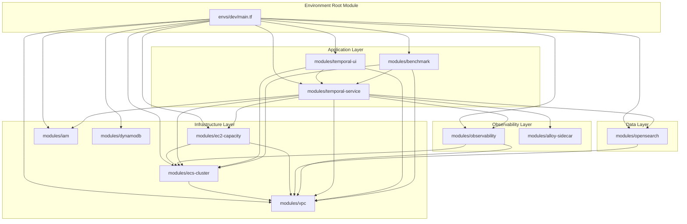

# Design Document: Terraform Modularization

## Status: ✅ COMPLETE

The modularization has been fully implemented. The flat Terraform configuration has been removed and replaced with the modular structure described below.

## Overview

This design document describes the architecture for restructuring the temporal-dsql-deploy-ecs Terraform infrastructure from a flat file structure to a modular architecture with environment-specific deployments. The new structure follows HashiCorp's recommended conventions for module development and style.

The modularization enables:
- **Code Reuse**: Common infrastructure patterns defined once, instantiated per environment
- **Environment Isolation**: Separate state and configuration for dev, bench, and prod
- **Maintainability**: Logical grouping of related resources with clear interfaces
- **Scalability**: Easy to add new environments or modify existing ones

## Architecture

### Implemented Directory Structure

```
terraform/
├── modules/
│   ├── vpc/
│   │   ├── main.tf           # VPC, subnets, NAT, IGW, route tables
│   │   ├── vpc-endpoints.tf  # VPC endpoints for AWS services
│   │   ├── variables.tf      # Module inputs
│   │   ├── outputs.tf        # Module outputs
│   │   └── README.md         # Module documentation
│   ├── ecs-cluster/
│   │   ├── main.tf           # ECS cluster, Service Connect namespace
│   │   ├── variables.tf
│   │   ├── outputs.tf
│   │   └── README.md
│   ├── ec2-capacity/
│   │   ├── main.tf           # Launch template, ASG, capacity provider
│   │   ├── iam.tf            # EC2 instance role
│   │   ├── security-groups.tf
│   │   ├── variables.tf
│   │   ├── outputs.tf
│   │   └── README.md
│   ├── temporal-service/
│   │   ├── main.tf           # Task definition, ECS service
│   │   ├── security-groups.tf
│   │   ├── variables.tf
│   │   ├── outputs.tf
│   │   └── README.md
│   ├── temporal-ui/
│   │   ├── main.tf
│   │   ├── variables.tf
│   │   ├── outputs.tf
│   │   └── README.md
│   ├── observability/
│   │   ├── main.tf           # Prometheus workspace
│   │   ├── grafana.tf        # Grafana ECS service
│   │   ├── loki.tf           # Loki ECS service
│   │   ├── loki-s3.tf        # S3 bucket for Loki
│   │   ├── templates/
│   │   │   └── loki-config.yaml
│   │   ├── variables.tf
│   │   ├── outputs.tf
│   │   └── README.md
│   ├── opensearch/
│   │   ├── main.tf           # OpenSearch domain, setup task
│   │   ├── security-groups.tf
│   │   ├── variables.tf
│   │   ├── outputs.tf
│   │   └── README.md
│   ├── benchmark/
│   │   ├── main.tf           # Benchmark task definition
│   │   ├── worker.tf         # Benchmark worker service
│   │   ├── ec2.tf            # Benchmark capacity provider
│   │   ├── security-groups.tf
│   │   ├── iam.tf
│   │   ├── variables.tf
│   │   ├── outputs.tf
│   │   └── README.md
│   ├── iam/
│   │   ├── main.tf           # Shared IAM roles
│   │   ├── variables.tf
│   │   ├── outputs.tf
│   │   └── README.md
│   ├── alloy-sidecar/
│   │   ├── main.tf           # SSM parameters, container definitions
│   │   ├── templates/
│   │   │   └── alloy-sidecar-config.alloy
│   │   ├── variables.tf
│   │   ├── outputs.tf
│   │   └── README.md
│   └── dynamodb/
│       ├── main.tf           # DynamoDB tables for rate limiting and conn leasing
│       ├── variables.tf
│       ├── outputs.tf
│       └── README.md
├── envs/
│   ├── dev/
│   │   ├── terraform.tf      # required_version, required_providers
│   │   ├── providers.tf      # AWS provider configuration
│   │   ├── main.tf           # Module instantiations
│   │   ├── variables.tf      # Environment-specific variables
│   │   ├── outputs.tf        # Environment outputs
│   │   ├── terraform.tfvars.example  # Example values
│   │   └── README.md
│   ├── bench/
│   │   ├── terraform.tf
│   │   ├── providers.tf
│   │   ├── main.tf           # Includes benchmark module
│   │   ├── variables.tf
│   │   ├── outputs.tf
│   │   ├── terraform.tfvars.example
│   │   └── README.md
│   └── prod/
│       ├── terraform.tf
│       ├── providers.tf
│       ├── main.tf
│       ├── variables.tf
│       ├── outputs.tf
│       ├── terraform.tfvars.example
│       └── README.md
└── .gitignore
```

**Note:** The original flat Terraform configuration has been removed. All infrastructure is now managed through the modular structure above.

### Module Dependency Graph



## Components and Interfaces

### Module: vpc

**Purpose**: Creates VPC networking infrastructure including subnets, NAT Gateway, and VPC endpoints.

**Inputs (variables.tf)**:
| Variable | Type | Description | Default |
|----------|------|-------------|---------|
| project_name | string | Project name for resource naming | required |
| vpc_cidr | string | CIDR block for VPC | "10.0.0.0/16" |
| availability_zones | list(string) | AZs for subnet distribution | required |
| enable_vpc_endpoints | bool | Create VPC endpoints for AWS services | true |

**Outputs (outputs.tf)**:
| Output | Type | Description |
|--------|------|-------------|
| vpc_id | string | ID of the created VPC |
| vpc_cidr | string | CIDR block of the VPC |
| private_subnet_ids | list(string) | IDs of private subnets |
| public_subnet_id | string | ID of NAT Gateway subnet |
| nat_gateway_id | string | ID of NAT Gateway |

### Module: ecs-cluster

**Purpose**: Creates ECS cluster with Service Connect namespace and Container Insights.

**Inputs (variables.tf)**:
| Variable | Type | Description | Default |
|----------|------|-------------|---------|
| project_name | string | Project name for resource naming | required |
| log_retention_days | number | CloudWatch log retention | 7 |

**Outputs (outputs.tf)**:
| Output | Type | Description |
|--------|------|-------------|
| cluster_id | string | ID of ECS cluster |
| cluster_arn | string | ARN of ECS cluster |
| cluster_name | string | Name of ECS cluster |
| service_connect_namespace_arn | string | ARN of Service Connect namespace |
| ecs_exec_log_group_name | string | Name of ECS Exec log group |

### Module: ec2-capacity

**Purpose**: Creates EC2 capacity provider with Auto Scaling Group for ECS tasks.

**Inputs (variables.tf)**:
| Variable | Type | Description | Default |
|----------|------|-------------|---------|
| project_name | string | Project name for resource naming | required |
| cluster_name | string | ECS cluster name | required |
| vpc_id | string | VPC ID | required |
| subnet_ids | list(string) | Subnet IDs for instances | required |
| instance_type | string | EC2 instance type | "m7g.xlarge" |
| instance_count | number | Desired instance count | 2 |
| workload_type | string | Workload identifier (main/benchmark) | "main" |

**Outputs (outputs.tf)**:
| Output | Type | Description |
|--------|------|-------------|
| capacity_provider_name | string | Name of capacity provider |
| asg_name | string | Name of Auto Scaling Group |
| instance_security_group_id | string | Security group for instances |
| instance_role_arn | string | ARN of EC2 instance role |

### Module: temporal-service

**Purpose**: Creates a single Temporal service (History, Matching, Frontend, or Worker).

**Inputs (variables.tf)**:
| Variable | Type | Description | Default |
|----------|------|-------------|---------|
| project_name | string | Project name | required |
| service_type | string | Service type (history/matching/frontend/worker) | required |
| image | string | Docker image URI | required |
| cpu | number | CPU units | 1024 |
| memory | number | Memory in MB | 2048 |
| desired_count | number | Task count | 0 |
| cluster_id | string | ECS cluster ID | required |
| cluster_name | string | ECS cluster name | required |
| vpc_id | string | VPC ID | required |
| subnet_ids | list(string) | Subnet IDs | required |
| capacity_provider_name | string | Capacity provider name | required |
| instance_security_group_id | string | Instance SG ID | required |
| service_connect_namespace_arn | string | Service Connect namespace ARN | required |
| execution_role_arn | string | ECS execution role ARN | required |
| task_role_arn | string | Task role ARN | required |
| dsql_endpoint | string | DSQL cluster endpoint | required |
| dsql_rate_limiter_table | string | DynamoDB table for rate limiting | required |
| dsql_reservoir_enabled | bool | Enable connection reservoir | false |
| dsql_reservoir_target_ready | number | Target connections in reservoir | 50 |
| dsql_reservoir_base_lifetime | string | Connection base lifetime | "11m" |
| dsql_reservoir_lifetime_jitter | string | Lifetime jitter range | "2m" |
| dsql_reservoir_guard_window | string | Guard window before expiry | "45s" |
| dsql_distributed_conn_lease_enabled | bool | Enable distributed conn leasing | false |
| dsql_conn_lease_table | string | DynamoDB table for conn leasing | "" |
| dsql_distributed_conn_limit | number | Global connection limit | 10000 |
| opensearch_endpoint | string | OpenSearch endpoint | required |
| opensearch_visibility_index | string | Visibility index name | required |
| history_shards | number | Number of history shards | 4096 |
| log_retention_days | number | Log retention | 7 |
| loki_enabled | bool | Enable Alloy sidecar | false |
| alloy_init_container | object | Alloy init container definition | null |
| alloy_sidecar_container | object | Alloy sidecar container definition | null |

**Outputs (outputs.tf)**:
| Output | Type | Description |
|--------|------|-------------|
| service_name | string | ECS service name |
| task_definition_arn | string | Task definition ARN |
| security_group_id | string | Service security group ID |
| log_group_name | string | CloudWatch log group name |

### Module: observability

**Purpose**: Creates observability stack (Prometheus, Grafana, optionally Loki).

**Inputs (variables.tf)**:
| Variable | Type | Description | Default |
|----------|------|-------------|---------|
| project_name | string | Project name | required |
| cluster_id | string | ECS cluster ID | required |
| vpc_id | string | VPC ID | required |
| subnet_ids | list(string) | Subnet IDs | required |
| loki_enabled | bool | Enable Loki | true |
| grafana_image | string | Grafana image | "grafana/grafana-oss:latest" |
| grafana_admin_secret_name | string | Secrets Manager secret name | required |
| loki_image | string | Loki image | "grafana/loki:3.0.0" |
| loki_retention_days | number | Loki retention | 7 |

**Outputs (outputs.tf)**:
| Output | Type | Description |
|--------|------|-------------|
| prometheus_workspace_arn | string | Prometheus workspace ARN |
| prometheus_remote_write_endpoint | string | Remote write endpoint |
| prometheus_query_endpoint | string | Query endpoint |
| loki_endpoint | string | Loki HTTP endpoint |
| loki_s3_bucket_name | string | Loki S3 bucket name |
| grafana_service_name | string | Grafana ECS service name |

### Module: alloy-sidecar

**Purpose**: Generates Alloy sidecar container definitions for metrics and log collection.

**Inputs (variables.tf)**:
| Variable | Type | Description | Default |
|----------|------|-------------|---------|
| project_name | string | Project name | required |
| service_name | string | Service name for labeling | required |
| prometheus_remote_write_endpoint | string | AMP remote write endpoint | required |
| loki_endpoint | string | Loki push endpoint | required |
| region | string | AWS region | required |
| alloy_image | string | Alloy image | "grafana/alloy:v1.4.0" |
| log_group_name | string | CloudWatch log group for Alloy | required |

**Outputs (outputs.tf)**:
| Output | Type | Description |
|--------|------|-------------|
| init_container_definition | object | Init container JSON |
| sidecar_container_definition | object | Sidecar container JSON |
| ssm_parameter_arn | string | SSM parameter ARN |

## Data Models

### Environment Configuration Model

Each environment has a configuration that determines resource sizing and feature enablement:

```hcl
# envs/dev/terraform.tfvars
project_name = "temporal-dev"
region       = "eu-west-1"

# Minimal resources for development
ec2_instance_type  = "m7g.large"
ec2_instance_count = 2

temporal_history_count  = 2
temporal_matching_count = 2
temporal_frontend_count = 1
temporal_worker_count   = 1

# Observability
loki_enabled = true

# No benchmark in dev
benchmark_enabled = false

# Connection Reservoir (disabled in dev for simplicity)
dsql_reservoir_enabled              = false
dsql_distributed_conn_lease_enabled = false
```

```hcl
# envs/bench/terraform.tfvars
project_name = "temporal-bench"
region       = "eu-west-1"

# Larger resources for benchmarking
ec2_instance_type  = "m7g.2xlarge"
ec2_instance_count = 10

temporal_history_count  = 8
temporal_matching_count = 6
temporal_frontend_count = 4
temporal_worker_count   = 2

# Observability
loki_enabled = true

# Benchmark enabled
benchmark_enabled      = true
benchmark_max_instances = 8

# Connection Reservoir (enabled for load testing)
dsql_reservoir_enabled              = true
dsql_reservoir_target_ready         = 50
dsql_reservoir_base_lifetime        = "11m"
dsql_reservoir_lifetime_jitter      = "2m"
dsql_reservoir_guard_window         = "45s"
dsql_distributed_conn_lease_enabled = true
dsql_distributed_conn_limit         = 10000
```

```hcl
# envs/prod/terraform.tfvars
project_name = "temporal-prod"
region       = "eu-west-1"

# Production-grade resources
ec2_instance_type  = "m7g.2xlarge"
ec2_instance_count = 10

temporal_history_count  = 8
temporal_matching_count = 6
temporal_frontend_count = 4
temporal_worker_count   = 2

# Observability
loki_enabled = true

# No benchmark in prod
benchmark_enabled = false

# Connection Reservoir (enabled for production reliability)
dsql_reservoir_enabled              = true
dsql_reservoir_target_ready         = 50
dsql_reservoir_base_lifetime        = "11m"
dsql_reservoir_lifetime_jitter      = "2m"
dsql_reservoir_guard_window         = "45s"
dsql_distributed_conn_lease_enabled = true
dsql_distributed_conn_limit         = 10000
```

### Module Instantiation Pattern

Environment main.tf follows a consistent pattern:

```hcl
# envs/dev/main.tf

# Infrastructure Layer
module "vpc" {
  source = "../../modules/vpc"
  
  project_name       = var.project_name
  vpc_cidr           = var.vpc_cidr
  availability_zones = var.availability_zones
}

module "ecs_cluster" {
  source = "../../modules/ecs-cluster"
  
  project_name       = var.project_name
  log_retention_days = var.log_retention_days
}

module "ec2_capacity" {
  source = "../../modules/ec2-capacity"
  
  project_name   = var.project_name
  cluster_name   = module.ecs_cluster.cluster_name
  vpc_id         = module.vpc.vpc_id
  subnet_ids     = module.vpc.private_subnet_ids
  instance_type  = var.ec2_instance_type
  instance_count = var.ec2_instance_count
}

# Data Layer
module "opensearch" {
  source = "../../modules/opensearch"
  
  project_name         = var.project_name
  vpc_id               = module.vpc.vpc_id
  subnet_ids           = module.vpc.private_subnet_ids
  visibility_index     = var.opensearch_visibility_index
}

# Observability Layer
module "observability" {
  source = "../../modules/observability"
  
  project_name              = var.project_name
  cluster_id                = module.ecs_cluster.cluster_id
  vpc_id                    = module.vpc.vpc_id
  subnet_ids                = module.vpc.private_subnet_ids
  loki_enabled              = var.loki_enabled
  grafana_admin_secret_name = var.grafana_admin_secret_name
}

# Application Layer - Temporal Services
module "temporal_history" {
  source = "../../modules/temporal-service"
  
  project_name                  = var.project_name
  service_type                  = "history"
  image                         = var.temporal_image
  cpu                           = var.temporal_history_cpu
  memory                        = var.temporal_history_memory
  desired_count                 = var.temporal_history_count
  cluster_id                    = module.ecs_cluster.cluster_id
  cluster_name                  = module.ecs_cluster.cluster_name
  vpc_id                        = module.vpc.vpc_id
  subnet_ids                    = module.vpc.private_subnet_ids
  capacity_provider_name        = module.ec2_capacity.capacity_provider_name
  instance_security_group_id    = module.ec2_capacity.instance_security_group_id
  service_connect_namespace_arn = module.ecs_cluster.service_connect_namespace_arn
  execution_role_arn            = module.iam.execution_role_arn
  task_role_arn                 = module.iam.temporal_task_role_arn
  dsql_endpoint                 = var.dsql_cluster_endpoint
  opensearch_endpoint           = module.opensearch.domain_endpoint
  opensearch_visibility_index   = var.opensearch_visibility_index
  loki_enabled                  = var.loki_enabled
  alloy_init_container          = module.alloy_history.init_container_definition
  alloy_sidecar_container       = module.alloy_history.sidecar_container_definition
}

# Similar blocks for matching, frontend, worker...
```

## Correctness Properties

*A property is a characteristic or behavior that should hold true across all valid executions of a system-essentially, a formal statement about what the system should do. Properties serve as the bridge between human-readable specifications and machine-verifiable correctness guarantees.*


Based on the prework analysis, the following properties have been consolidated to eliminate redundancy:

### Property 1: Module Directory Structure Compliance

*For any* module in the terraform/modules/ directory, the module SHALL contain main.tf, variables.tf, outputs.tf, and README.md files.

**Validates: Requirements 1.1, 1.5**

### Property 2: Environment Directory Structure Compliance

*For any* environment in the terraform/envs/ directory, the environment SHALL contain terraform.tf, providers.tf, main.tf, variables.tf, and outputs.tf files.

**Validates: Requirements 2.2**

### Property 3: Module Input Interface Compliance

*For any* module, the variables.tf file SHALL define all required input variables as specified in the design document's Components and Interfaces section.

**Validates: Requirements 3.2, 4.2, 5.2, 6.2, 6.3, 7.2, 8.2, 9.2, 10.2, 11.2, 12.2**

### Property 4: Module Output Interface Compliance

*For any* module, the outputs.tf file SHALL define all required outputs as specified in the design document's Components and Interfaces section.

**Validates: Requirements 3.3, 4.3, 5.3, 6.4, 7.4, 8.3, 9.3, 10.3, 11.3, 12.3**

### Property 5: Module Resource Encapsulation

*For any* module, the Terraform files SHALL define all required resources as specified in the design document's Components and Interfaces section.

**Validates: Requirements 3.1, 4.1, 5.1, 6.1, 7.1, 8.1, 9.1, 10.1, 11.1, 12.1**

### Property 6: Template File Organization

*For any* module that uses templatefile() function, the module directory SHALL contain a templates/ subdirectory with the referenced template files.

**Validates: Requirements 1.4**

### Property 7: State Isolation

*For any* environment, the Terraform backend configuration SHALL use an environment-specific state key or workspace to ensure state isolation.

**Validates: Requirements 2.5, 14.1, 14.2**

### Property 8: Conditional Resource Creation

*For any* conditional resource (Loki, Benchmark), WHEN the enabling variable is false, the resource count SHALL be 0, and WHEN true, the resource count SHALL be greater than 0.

**Validates: Requirements 8.4, 10.5**

### Property 9: Script Environment Parameter Handling

*For any* operational script (scale-services.sh, scale-benchmark-workers.sh), the script SHALL accept an environment parameter, validate it exists, change to the correct directory, and provide clear error messages for invalid inputs.

**Validates: Requirements 16.1, 16.2, 16.3, 16.4, 16.5, 16.6**

### Property 10: Terraform Validation

*For any* environment configuration, running `terraform validate` SHALL succeed without errors.

**Validates: Requirements 1.1, 2.2, 3.1, 4.1, 5.1, 6.1, 7.1, 8.1, 9.1, 10.1, 11.1, 12.1**

### Property 11: Connection Reservoir Configuration

*For any* Temporal service, WHEN dsql_reservoir_enabled is true, the task definition SHALL include environment variables for DSQL_RESERVOIR_ENABLED, DSQL_RESERVOIR_TARGET_READY, DSQL_RESERVOIR_BASE_LIFETIME, DSQL_RESERVOIR_LIFETIME_JITTER, and DSQL_RESERVOIR_GUARD_WINDOW.

**Validates: Requirements 17.2**

### Property 12: Distributed Connection Lease Configuration

*For any* Temporal service, WHEN dsql_distributed_conn_lease_enabled is true, the task definition SHALL include environment variables for DSQL_DISTRIBUTED_CONN_LEASE_ENABLED, DSQL_DISTRIBUTED_CONN_LEASE_TABLE, and DSQL_DISTRIBUTED_CONN_LIMIT, AND the DynamoDB module SHALL create a connection lease table.

**Validates: Requirements 17.1, 17.3, 17.6**

## Error Handling

### Module Instantiation Errors

When a module is instantiated with missing required variables:
- Terraform will fail during `terraform plan` with a clear error message indicating which variable is missing
- The error message will include the variable name and the module path

### State Migration Errors

When state migration fails:
1. The migration script will output the specific `terraform state mv` command that failed
2. The original state file will remain unchanged (Terraform creates backups)
3. Rollback procedure: restore from the backup state file

### Environment Validation Errors

When an invalid environment is specified to scripts:
1. Scripts will check if the environment directory exists
2. If not found, scripts will output available environments and exit with code 1
3. Example error: `Error: Environment 'staging' not found. Available: dev, bench, prod`

### Circular Dependency Prevention

Module dependencies are designed to be acyclic:
- Infrastructure modules (vpc, ecs-cluster) have no dependencies on application modules
- Application modules depend on infrastructure modules
- No module depends on another module at the same layer

## Testing Strategy

### Dual Testing Approach

Testing will use both unit tests and property-based validation:

1. **Unit Tests (terraform validate)**: Verify each module and environment configuration is syntactically valid
2. **Property Tests**: Verify structural properties hold across all modules and environments

### Terraform Validation Tests

For each module and environment:
```bash
# Validate module syntax
cd terraform/modules/<module>
terraform init -backend=false
terraform validate

# Validate environment syntax
cd terraform/envs/<env>
terraform init -backend=false
terraform validate
```

### Structure Validation Tests

Property-based tests will verify:
1. All modules contain required files (main.tf, variables.tf, outputs.tf, README.md)
2. All environments contain required files (terraform.tf, providers.tf, main.tf, variables.tf, outputs.tf)
3. Module interfaces match the design specification

### Script Tests

For operational scripts:
```bash
# Test environment parameter validation
./scripts/scale-services.sh invalid-env  # Should fail with clear error
./scripts/scale-services.sh dev          # Should succeed (or fail gracefully if not deployed)

# Test help output
./scripts/scale-services.sh --help       # Should show usage
```

### Integration Tests

After deployment to a test environment:
1. Verify all ECS services are running
2. Verify Service Connect DNS resolution works
3. Verify Temporal Frontend is accessible
4. Verify Grafana can query Prometheus

### Test Configuration

- **Minimum iterations**: 100 for property-based tests (all modules/environments)
- **Test tagging**: Each test references the design property it validates
- **Tag format**: `Feature: terraform-modularization, Property N: <property_text>`

## Migration Strategy

### Phase 1: Create Module Structure

1. Create terraform/modules/ directory
2. Create each module with files extracted from current flat structure
3. Validate each module independently with `terraform validate`

### Phase 2: Create Environment Structure

1. Create terraform/envs/dev/ directory
2. Create terraform.tf, providers.tf, main.tf, variables.tf, outputs.tf
3. Instantiate modules in main.tf
4. Validate with `terraform validate`

### Phase 3: State Migration

For each resource in the current state:
```bash
# Example: Move VPC resource to module
terraform state mv aws_vpc.main module.vpc.aws_vpc.main

# Example: Move ECS cluster to module
terraform state mv aws_ecs_cluster.main module.ecs_cluster.aws_ecs_cluster.main
```

### Phase 4: Validation

1. Run `terraform plan` - should show no changes
2. Verify all outputs are still accessible
3. Test operational scripts work with new structure

### Phase 5: Create Additional Environments

1. Copy dev environment to bench and prod
2. Adjust terraform.tfvars for each environment
3. Initialize separate state for each environment

### Rollback Procedure

If migration fails:
1. Restore state from backup: `cp terraform.tfstate.backup terraform.tfstate`
2. Revert code changes: `git checkout -- terraform/`
3. Re-run `terraform plan` to verify original state

## Appendix: File Mapping

### Current to Module Mapping

| Current File | Target Module | Target File |
|--------------|---------------|-------------|
| vpc.tf | modules/vpc | main.tf |
| vpc-endpoints.tf | modules/vpc | vpc-endpoints.tf |
| ecs-cluster.tf | modules/ecs-cluster | main.tf |
| ec2-cluster.tf | modules/ec2-capacity | main.tf |
| temporal-history.tf | modules/temporal-service | main.tf (parameterized) |
| temporal-matching.tf | modules/temporal-service | main.tf (parameterized) |
| temporal-frontend.tf | modules/temporal-service | main.tf (parameterized) |
| temporal-worker.tf | modules/temporal-service | main.tf (parameterized) |
| temporal-ui.tf | modules/temporal-ui | main.tf |
| grafana.tf | modules/observability | grafana.tf |
| loki.tf | modules/observability | loki.tf |
| loki-s3.tf | modules/observability | loki-s3.tf |
| prometheus.tf | modules/observability | main.tf |
| opensearch.tf | modules/opensearch | main.tf |
| benchmark.tf | modules/benchmark | main.tf |
| benchmark-worker.tf | modules/benchmark | worker.tf |
| benchmark-ec2.tf | modules/benchmark | ec2.tf |
| iam.tf | modules/iam | main.tf |
| security-groups.tf | Split across modules | security-groups.tf |
| alloy-sidecar.tf | modules/alloy-sidecar | main.tf |
| dynamodb.tf | modules/dynamodb | main.tf |
| cloudwatch.tf | Split across modules | (log groups per module) |
| secrets.tf | modules/observability | secrets.tf |
